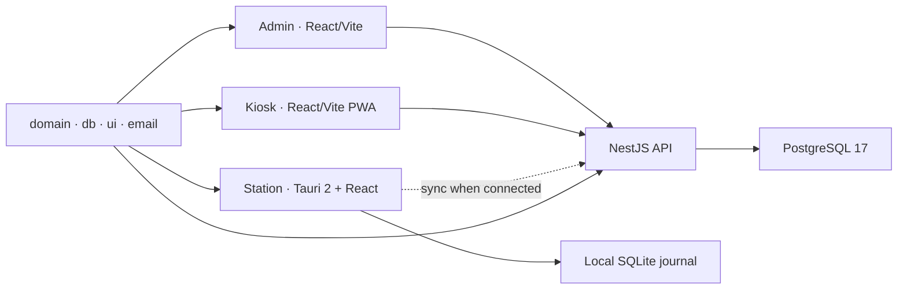

<p align="center">
  <picture>
    <source media="(prefers-color-scheme: dark)" srcset="./docs/assets/readme/logo-dark.svg">
    <source media="(prefers-color-scheme: light)" srcset="./docs/assets/readme/logo.svg">
    
  </picture>
</p>

<p align="center"><strong>English</strong> · <a href="./README.ru.md">Русский</a></p>

<p align="center">
  Offline-first production workflows for Chestny ZNAK: serialization, aggregation, traceability, and shop-floor operations.
</p>

<p align="center">
  <a href="https://github.com/thevladbog/markiro/actions/workflows/ci.yml"></a>
  <a href="https://github.com/thevladbog/markiro/actions/workflows/codeql.yml"></a>
  
  
  
  
  
  
  <a href="./LICENSE"></a>
</p>


<p align="center"><em>Product design preview — aggregation mode on the offline-capable line station.</em></p>

## What is Markiro?

Markiro is an industrial platform for Russian Chestny ZNAK production workflows. It connects office administration, line-side scanning, aggregation and label printing, employee pickup, traceability, and external integrations without making continuous connectivity a condition for safe factory work.

The platform is built for real production constraints: multiple terminals in one shift, device-local journals, duplicate and foreign-GTIN rejection, degraded hardware states, auditable recovery actions, and eventual synchronization with the server.

## Why it exists

- **Keep the line moving.** Station and kiosk workflows retain local state and recover after connectivity returns.
- **Reject bad input at the edge.** Shared GS1/GTIN/KM logic catches malformed, duplicate, and wrong-product codes before they become reporting problems.
- **Aggregate and print consistently.** SSCC allocation, box/pallet workflows, and ZPL/TSPL output use shared domain rules.
- **Keep every boundary explicit.** Tenant data, cabinet sessions, device credentials, and operator identity have separate enforcement paths.
- **Integrate with existing operations.** The API and CommerceML/1C flows connect Markiro to surrounding systems without moving factory recovery online-only.

## Product surfaces

<table>
  <tr>
    <td width="50%"><a href="./docs/assets/readme/admin.webp"></a></td>
    <td width="50%"><a href="./docs/assets/readme/kiosk.webp"></a></td>
  </tr>
  <tr>
    <td><strong>Admin panel.</strong> Products, shifts, label templates, integrations, teams, pickup orders, and operational audit.</td>
    <td><strong>Pickup kiosk.</strong> Badge-based employee pickup with local limits, offline snapshots, queued orders, and recovery.</td>
  </tr>
</table>

<p align="center"><em>Product design previews from the approved Markiro handoff; they are not screenshots of a verified live deployment.</em></p>

## Core capabilities

| Area                  | What is implemented                                                                                      |
| --------------------- | -------------------------------------------------------------------------------------------------------- |
| Codes and validation  | GS1 check digits, GTIN normalization, KM parsing, scan classification, duplicate/error handling          |
| Production            | Shifts, multi-terminal scanning, offline journals, synchronization, conflicts, operator recovery actions |
| Aggregation           | SSCC pools, boxes, box labels, disassembly/reprint audit, shared aggregation state                       |
| Labels                | WYSIWYG templates, Cyrillic rasterization, ZPL/TSPL generation, product/shift bindings                   |
| Pickup                | Paired kiosks, badge resolution, daily limits, offline queue/quarantine, cabinet reconciliation          |
| SaaS and integrations | Multi-tenant cabinet, roles/capabilities, CommerceML/1C exchange, mail delivery, private object storage  |

## Architecture



Read [the architecture document](./docs/architecture.md) for tenant boundaries, authentication, retention, offline synchronization, deployment, and operational trade-offs.

## Quick start

### Prerequisites

- Node.js 24 or newer
- Corepack and pnpm 11.10.0
- Docker with Docker Compose

```bash
corepack enable
pnpm install --frozen-lockfile
pnpm --filter '@markiro/api^...' --filter '@markiro/admin^...' build
if [ ! -e .env ]; then
  cp .env.example .env
fi
docker compose -f docker-compose.dev.yml up -d
set -a
source .env
set +a
pnpm --filter @markiro/db db:migrate
pnpm --filter @markiro/api dev
```

Run the admin app in another terminal:

```bash
pnpm --filter @markiro/admin dev
```

The admin UI is available at `http://localhost:5173`; the API and Scalar OpenAPI explorer use `http://localhost:3000` and `http://localhost:3000/docs`. The development stack also exposes Mailpit at `http://localhost:8025` and MinIO Console at `http://localhost:9001`. Values in `.env.example` are development-only.

<details>
<summary>Provision the first tenant owner</summary>

Build the API, then create an activation without putting a password in shell history:

```bash
pnpm --filter @markiro/api build
pnpm --silent --filter @markiro/api provision:tenant-owner -- \
  --email owner@example.com \
  --tenant-name "First factory" \
  --tenant-slug first-factory
```

The command is idempotent for the same tenant/email and prints identifiers only. Use `--renew-activation` only for an unused expired activation.
</details>

## Development

```text
apps/
  api/       NestJS API, auth, jobs, integrations
  admin/     React/Vite production cabinet
  kiosk/     Offline-first pickup PWA
  station/   Tauri/React line workstation
packages/
  domain/    GS1, KM, SSCC, labels, shared policy
  db/        PostgreSQL schema, migrations, SQLite mirror
  email/     Transactional email templates
  ui/        Shared design tokens and React components
```

Focused iteration:

```bash
pnpm --filter @markiro/domain test
pnpm --filter @markiro/api exec vitest run test/relevant-file.test.ts
```

Full validation:

```bash
pnpm turbo lint typecheck test build --concurrency=1 --force
pnpm format:check
```

Database-backed tests require the exported `DATABASE_URL`. Report intentional skips and external/browser/hardware verification separately.

## Documentation

- [Agent guide](./AGENTS.md)
- [Architecture](./docs/architecture.md)
- [Design briefs](./docs/design-briefs/)
- [Implementation plans](./docs/superpowers/plans/)
- [MVP roadmap](./docs/superpowers/plans/2026-07-21-markiro-mvp-roadmap.md)
- [OpenAPI explorer](http://localhost:3000/docs) when the API is running

## License

Copyright © 2026 Vladislav Bogatyrev. This repository is proprietary and all rights are reserved. See [LICENSE](./LICENSE).
