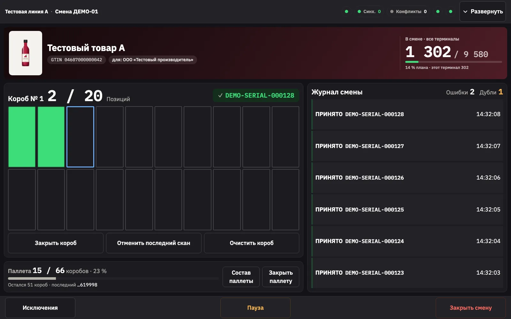
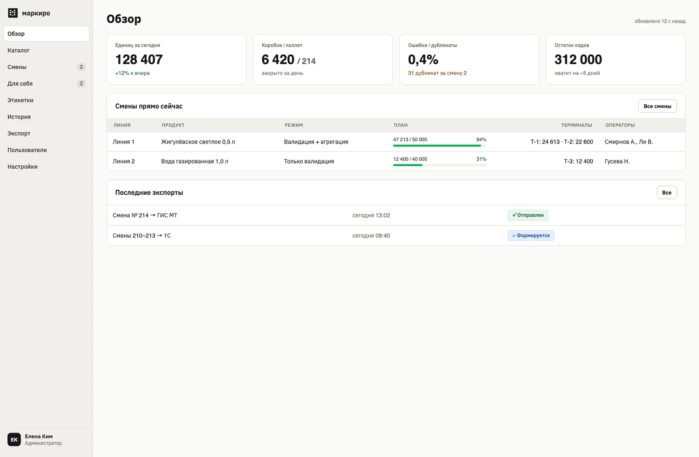
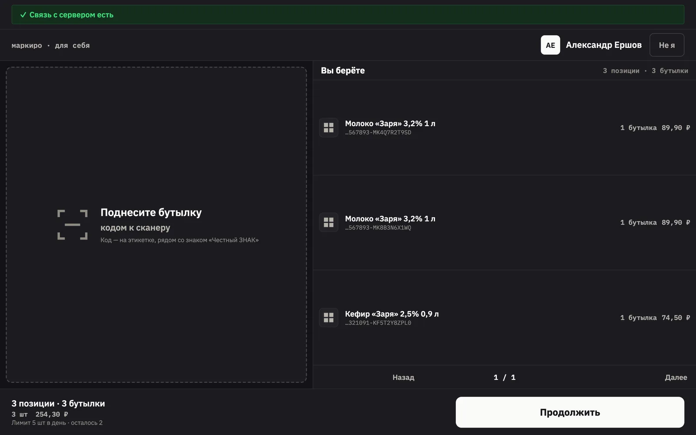
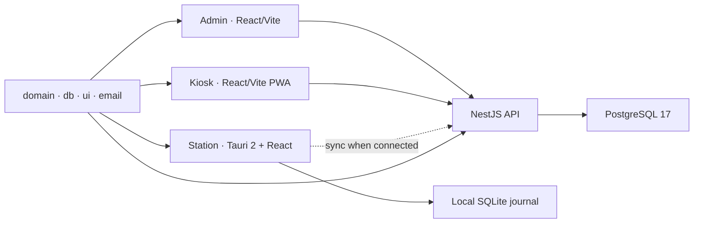

<p align="center">
  <picture>
    <source media="(prefers-color-scheme: dark)" srcset="./docs/assets/readme/logo-dark.svg">
    <source media="(prefers-color-scheme: light)" srcset="./docs/assets/readme/logo.svg">
    
  </picture>
</p>

<p align="center"><a href="./README.md">English</a> · <strong>Русский</strong></p>

<p align="center">
  Offline-first процессы для «Честного знака»: сериализация, агрегация, прослеживаемость и работа производственной линии.
</p>

<p align="center">
  <a href="https://github.com/thevladbog/markiro/actions/workflows/ci.yml"></a>
  <a href="https://github.com/thevladbog/markiro/actions/workflows/codeql.yml"></a>
  
  
  
  
  
  
  <a href="./LICENSE"></a>
</p>



<p align="center"><em>Дизайн-концепт продукта — режим агрегации на линейной станции с поддержкой автономной работы.</em></p>

## Что такое «Маркиро»?

«Маркиро» — единая промышленная платформа для российских производственных процессов с «Честным знаком». Она объединяет кабинет, линейную станцию, киоск, агрегацию и печать этикеток, прослеживаемость и внешние интеграции, не требуя постоянного подключения для безопасной работы производства.

Платформа учитывает реальные производственные условия: несколько терминалов в одной смене, локальные журналы устройств, отклонение дубликатов и кодов с чужим GTIN, деградацию оборудования, аудируемые действия по восстановлению и последующую синхронизацию с сервером.

## Зачем нужен продукт

- **Чтобы линия не останавливалась.** Станция и киоск сохраняют локальное состояние и восстанавливают работу после возвращения подключения.
- **Чтобы отклонять некорректные данные на месте.** Общая логика GS1/GTIN/KM выявляет повреждённые коды, дубликаты и коды другого товара до того, как они создадут проблемы в отчётности.
- **Чтобы агрегировать и печатать единообразно.** Пулы SSCC, операции с коробами и палетами, а также вывод в ZPL/TSPL опираются на общие доменные правила.
- **Чтобы каждая граница безопасности была явной.** Для данных арендаторов, сессий кабинета, учётных данных устройств и идентификации операторов действуют отдельные механизмы контроля.
- **Чтобы интегрироваться с действующими системами.** API и обмен CommerceML/1C связывают «Маркиро» с окружением предприятия, сохраняя восстановление производства offline-first.

## Интерфейсы продукта

<table>
  <tr>
    <td width="50%"></td>
    <td width="50%"></td>
  </tr>
  <tr>
    <td><strong>Админ-панель.</strong> Товары, смены, шаблоны этикеток, интеграции, команды, заказы на выдачу и операционный аудит.</td>
    <td><strong>Киоск «Для себя».</strong> Выдача сотрудникам по пропускам с локальными лимитами, offline-снимками, очередью заказов и восстановлением.</td>
  </tr>
</table>

<p align="center"><em>Дизайн-концепты из утверждённого handoff-пакета; это не скриншоты подтверждённого production-развёртывания.</em></p>

## Основные возможности

| Область           | Что реализовано                                                                                                 |
| ----------------- | --------------------------------------------------------------------------------------------------------------- |
| Коды и валидация  | Контрольные цифры GS1, нормализация GTIN, разбор KM, классификация сканов, обработка дубликатов и ошибок        |
| Производство      | Смены, сканирование на нескольких терминалах, offline-журналы, синхронизация, конфликты, действия операторов    |
| Агрегация         | Пулы SSCC, короба, этикетки коробов, аудит расформирования и повторной печати, общее состояние агрегации        |
| Этикетки          | WYSIWYG-шаблоны, растеризация кириллицы, генерация ZPL/TSPL, привязка к товарам и сменам                        |
| Выдача            | Сопряжённые киоски, распознавание пропусков, дневные лимиты, offline-очередь и карантин, сверка с кабинетом     |
| SaaS и интеграции | Мультитенантный кабинет, роли и возможности, обмен CommerceML/1C, отправка почты, приватное объектное хранилище |

## Архитектура



Подробнее о границах арендаторов, аутентификации, хранении данных, offline-синхронизации, развёртывании и эксплуатационных компромиссах — в [документе об архитектуре](./docs/architecture.md).

## Быстрый запуск

### Требования

- Node.js 24 или новее
- Corepack и pnpm 11.10.0
- Docker с Docker Compose

```bash
corepack enable
pnpm install --frozen-lockfile
if [ ! -e .env ]; then
  cp .env.example .env
fi
docker compose -f docker-compose.dev.yml up -d
set -a
source .env
set +a
pnpm --filter @markiro/db db:migrate
pnpm --filter @markiro/api dev
```

Запустите админ-панель в другом терминале:

```bash
pnpm --filter @markiro/admin dev
```

Админ-панель доступна по адресу `http://localhost:5173`; API и обозреватель Scalar OpenAPI — по адресам `http://localhost:3000` и `http://localhost:3000/docs`. Стек разработки также открывает Mailpit на `http://localhost:8025` и MinIO Console на `http://localhost:9001`. Значения из `.env.example` предназначены только для разработки.

<details>
<summary>Создать первого владельца арендатора</summary>

Соберите API, затем создайте активацию, не сохраняя пароль в истории командной оболочки:

```bash
pnpm --filter @markiro/api build
pnpm --silent --filter @markiro/api provision:tenant-owner -- \
  --email owner@example.com \
  --tenant-name "Первый завод" \
  --tenant-slug first-factory
```

Для одной и той же пары арендатора и адреса электронной почты команда идемпотентна и выводит только идентификаторы. Используйте `--renew-activation` только для неиспользованной активации с истёкшим сроком действия.
</details>

## Разработка

```text
apps/
  api/       NestJS API, auth, jobs, integrations
  admin/     React/Vite production cabinet
  kiosk/     Offline-first pickup PWA
  station/   Tauri/React line workstation
packages/
  domain/    GS1, KM, SSCC, labels, shared policy
  db/        PostgreSQL schema, migrations, SQLite mirror
  email/     Transactional email templates
  ui/        Shared design tokens and React components
```

Точечная проверка во время разработки:

```bash
pnpm --filter @markiro/domain test
pnpm --filter @markiro/api exec vitest run test/relevant-file.test.ts
```

Полная проверка:

```bash
pnpm turbo lint typecheck test build --concurrency=1 --force
pnpm format:check
```

Для тестов, работающих с базой данных, требуется экспортированная переменная `DATABASE_URL`. Сообщайте отдельно о намеренно пропущенных тестах и проверках во внешней среде, браузере или на оборудовании.

## Документация

- [Руководство для агентов](./AGENTS.md)
- [Архитектура](./docs/architecture.md)
- [Дизайн-брифы](./docs/design-briefs/)
- [Планы реализации](./docs/superpowers/plans/)
- [Обозреватель OpenAPI](http://localhost:3000/docs), когда API запущен

## Лицензия

Copyright © 2026 Vladislav Bogatyrev. Репозиторий является проприетарным; все права защищены. Полный текст — в файле [LICENSE](./LICENSE).
