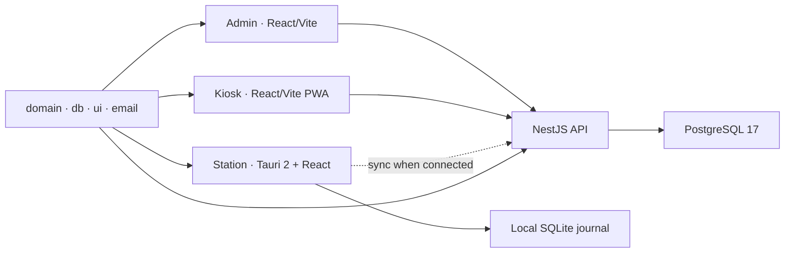

# Bilingual Product-Led README Implementation Plan

> **For agentic workers:** REQUIRED SUB-SKILL: Use superpowers:subagent-driven-development (recommended) or superpowers:executing-plans to implement this plan task-by-task. Steps use checkbox (`- [ ]`) syntax for tracking.

**Goal:** Replace the stale root README with an English-first bilingual product and developer entry point, using approved Markiro design assets and an explicit proprietary license.

**Architecture:** Keep both README files structurally identical and backed by one local asset set under `docs/assets/readme/`. Reuse the approved SVG logo directly, render the three interface previews from the existing HTML handoff with a temporary Playwright capture test, and convert captures with the repository's existing Sharp dependency. Validate claims against manifests, workflows, Compose, and current code rather than roadmap text.

**Tech Stack:** GitHub-Flavored Markdown, HTML `<picture>`/`table`, Mermaid, SVG, WebP, Playwright 1.62, Sharp 0.35, Node 24, pnpm 11.10.

## Global Constraints

- `README.md` is canonical English; `README.ru.md` is a complete Russian mirror.
- Preserve the accepted Markiro/«Прибор» identity; do not redesign the logo or UI.
- Use the same Russian handoff screenshots in both languages and localize captions.
- Label screenshots as product design previews, not production deployment proof.
- Describe only behavior present on current `main`; future work belongs behind roadmap links.
- Never overwrite an existing `.env` in Quick Start instructions.
- Add no dependency and do not modify the handoff unless capture proves a concrete defect.
- License mode is Proprietary / All Rights Reserved for Vladislav Bogatyrev, 2026.
- Do not stage the user's existing roadmap, station-exceptions, `.codex/`, or `.pnpm-store/` changes.
- Design source: `docs/superpowers/specs/2026-08-05-bilingual-readme-design.md`.

---

## File map

- Modify `README.md` — canonical English product-led README.
- Create `README.ru.md` — Russian mirror with identical structure and commands.
- Create `LICENSE` — concise proprietary All Rights Reserved notice.
- Create `docs/assets/readme/logo.svg` — light-background wordmark.
- Create `docs/assets/readme/logo-dark.svg` — dark-background wordmark.
- Create `docs/assets/readme/station.webp` — aggregation-mode line-station preview.
- Create `docs/assets/readme/admin.webp` — admin overview preview.
- Create `docs/assets/readme/kiosk.webp` — populated pickup-kiosk preview.
- Temporarily create then delete `tools/production-browser/tests/readme-assets.spec.ts` — reproducible capture probe; it must not remain in the final diff.

### Task 1: Proprietary notice and theme-aware brand assets

**Files:**

- Create: `LICENSE`
- Create: `docs/assets/readme/logo.svg`
- Create: `docs/assets/readme/logo-dark.svg`

**Interfaces:**

- Consumes: approved logo SVGs from `docs/design-briefs/design_handoff_markiro/design-system/assets/`.
- Produces: stable local paths used by both README headers and a root license target used by the badge/link.

- [ ] **Step 1: Verify the deliverables do not exist yet**

Run:

```bash
for candidate_path in LICENSE docs/assets/readme/logo.svg docs/assets/readme/logo-dark.svg; do
  test ! -e "$candidate_path" || { echo "already exists: $candidate_path"; exit 1; }
done
```

Expected: no output and exit status 0. If a file now exists because the branch changed, inspect it and update this plan before overwriting anything.

- [ ] **Step 2: Create the asset directory and proprietary notice**

Create `docs/assets/readme/`, then add `LICENSE` with exactly:

```text
PROPRIETARY SOFTWARE LICENSE

Copyright © 2026 Vladislav Bogatyrev. All rights reserved.

This software and its source code are proprietary. Unless you have a separate
written agreement with the copyright holder, no permission is granted to use,
copy, modify, publish, distribute, sublicense, sell, or create derivative works
from this software, in whole or in part.

Public availability of the source code does not waive any rights or grant any
license. All rights not expressly granted in writing are reserved.

THE SOFTWARE IS PROVIDED "AS IS", WITHOUT WARRANTY OF ANY KIND, EXPRESS OR
IMPLIED, INCLUDING BUT NOT LIMITED TO THE WARRANTIES OF MERCHANTABILITY,
FITNESS FOR A PARTICULAR PURPOSE, AND NON-INFRINGEMENT. IN NO EVENT SHALL THE
COPYRIGHT HOLDER BE LIABLE FOR ANY CLAIM, DAMAGES, OR OTHER LIABILITY ARISING
FROM, OUT OF, OR IN CONNECTION WITH THE SOFTWARE OR ITS USE.
```

- [ ] **Step 3: Add the approved SVGs without altering paths or geometry**

Create `docs/assets/readme/logo.svg` with:

```svg
<svg xmlns="http://www.w3.org/2000/svg" width="280" height="64" viewBox="0 0 280 64"><rect x="4" y="4" width="56" height="56" fill="#17161A"></rect><g fill="#FAFAF8"><rect x="14" y="14" width="8" height="8"></rect><rect x="14" y="26" width="8" height="8"></rect><rect x="14" y="38" width="8" height="8"></rect><rect x="26" y="22" width="8" height="8"></rect><rect x="38" y="14" width="8" height="8"></rect><rect x="38" y="26" width="8" height="8"></rect><rect x="38" y="38" width="8" height="8"></rect><rect x="26" y="42" width="8" height="8" fill="#3DDC7A"></rect></g><text x="76" y="45" font-family="IBM Plex Mono, monospace" font-weight="600" font-size="34" letter-spacing="-0.5" fill="#17161A">маркиро</text></svg>
```

Create `docs/assets/readme/logo-dark.svg` with:

```svg
<svg xmlns="http://www.w3.org/2000/svg" width="280" height="64" viewBox="0 0 280 64"><rect x="4" y="4" width="56" height="56" fill="#FAFAF8"></rect><g fill="#17161A"><rect x="14" y="14" width="8" height="8"></rect><rect x="14" y="26" width="8" height="8"></rect><rect x="14" y="38" width="8" height="8"></rect><rect x="26" y="22" width="8" height="8"></rect><rect x="38" y="14" width="8" height="8"></rect><rect x="38" y="26" width="8" height="8"></rect><rect x="38" y="38" width="8" height="8"></rect><rect x="26" y="42" width="8" height="8" fill="#3DDC7A"></rect></g><text x="76" y="45" font-family="IBM Plex Mono, monospace" font-weight="600" font-size="34" letter-spacing="-0.5" fill="#FAFAF8">маркиро</text></svg>
```

- [ ] **Step 4: Verify exact provenance and parseability**

Run:

```bash
cmp docs/assets/readme/logo.svg docs/design-briefs/design_handoff_markiro/design-system/assets/logo.svg
cmp docs/assets/readme/logo-dark.svg docs/design-briefs/design_handoff_markiro/design-system/assets/logo-dark.svg
node -e "const fs=require('node:fs'); for (const f of ['docs/assets/readme/logo.svg','docs/assets/readme/logo-dark.svg']) { const s=fs.readFileSync(f,'utf8'); if (!s.startsWith('<svg') || !s.includes('viewBox=\"0 0 280 64\"')) throw new Error('invalid SVG: '+f); }"
rg -n 'Copyright © 2026 Vladislav Bogatyrev|All rights reserved|no permission is granted' LICENSE
git diff --check -- LICENSE docs/assets/readme
```

Expected: `cmp` and Node exit 0; `rg` prints the three license clauses; no whitespace errors.

- [ ] **Step 5: Visually inspect both logos**

Open both SVGs with the local image viewer. Confirm that the dark variant is readable on a dark canvas, the light variant is readable on a light canvas, the green module is present, and the wordmark is not clipped.

- [ ] **Step 6: Commit the notice and logo assets**

```bash
git add LICENSE docs/assets/readme/logo.svg docs/assets/readme/logo-dark.svg
git diff --cached --check
git diff --cached -- LICENSE docs/assets/readme/logo.svg docs/assets/readme/logo-dark.svg
git commit -m "docs: add Markiro brand and proprietary notice"
```

### Task 2: Reproducible handoff screenshots

**Files:**

- Temporarily create then delete: `tools/production-browser/tests/readme-assets.spec.ts`
- Create: `docs/assets/readme/station.webp`
- Create: `docs/assets/readme/admin.webp`
- Create: `docs/assets/readme/kiosk.webp`

**Interfaces:**

- Consumes: `line-station.dc.html`, `admin-panel.dc.html`, `pickup-kiosk.dc.html`, their shared scripts, local IBM Plex font files, Playwright, and Sharp.
- Produces: three stable WebP paths referenced identically by both README files.

- [ ] **Step 1: Add a failing asset-presence check**

Run:

```bash
for asset in station admin kiosk; do
  test -s "docs/assets/readme/$asset.webp" || { echo "missing: $asset.webp"; exit 1; }
done
```

Expected: FAIL on `station.webp`.

- [ ] **Step 2: Create the temporary Playwright capture test**

Add `tools/production-browser/tests/readme-assets.spec.ts`:

```ts
import { mkdir } from "node:fs/promises";
import { join } from "node:path";
import { expect, test, type Page } from "@playwright/test";

const baseUrl = process.env.MARKIRO_HANDOFF_BASE_URL ?? "http://127.0.0.1:4178";
const outputDir = "/private/tmp/markiro-readme-captures";

async function installLocalFonts(page: Page): Promise<void> {
  await page.addStyleTag({
    content: `
      @font-face {
        font-family: "IBM Plex Sans";
        font-style: normal;
        font-weight: 400;
        src: url("${baseUrl}/packages/ui/node_modules/@fontsource/ibm-plex-sans/files/ibm-plex-sans-cyrillic-400-normal.woff2") format("woff2");
      }
      @font-face {
        font-family: "IBM Plex Sans";
        font-style: normal;
        font-weight: 500;
        src: url("${baseUrl}/packages/ui/node_modules/@fontsource/ibm-plex-sans/files/ibm-plex-sans-cyrillic-500-normal.woff2") format("woff2");
      }
      @font-face {
        font-family: "IBM Plex Sans";
        font-style: normal;
        font-weight: 600;
        src: url("${baseUrl}/packages/ui/node_modules/@fontsource/ibm-plex-sans/files/ibm-plex-sans-cyrillic-600-normal.woff2") format("woff2");
      }
      @font-face {
        font-family: "IBM Plex Sans";
        font-style: normal;
        font-weight: 700;
        src: url("${baseUrl}/packages/ui/node_modules/@fontsource/ibm-plex-sans/files/ibm-plex-sans-cyrillic-700-normal.woff2") format("woff2");
      }
      @font-face {
        font-family: "IBM Plex Mono";
        font-style: normal;
        font-weight: 400;
        src: url("${baseUrl}/packages/ui/node_modules/@fontsource/ibm-plex-mono/files/ibm-plex-mono-cyrillic-400-normal.woff2") format("woff2");
      }
      @font-face {
        font-family: "IBM Plex Mono";
        font-style: normal;
        font-weight: 500;
        src: url("${baseUrl}/packages/ui/node_modules/@fontsource/ibm-plex-mono/files/ibm-plex-mono-cyrillic-500-normal.woff2") format("woff2");
      }
      @font-face {
        font-family: "IBM Plex Mono";
        font-style: normal;
        font-weight: 600;
        src: url("${baseUrl}/packages/ui/node_modules/@fontsource/ibm-plex-mono/files/ibm-plex-mono-cyrillic-600-normal.woff2") format("woff2");
      }
      * { font-family: "IBM Plex Sans", sans-serif !important; }
      code, pre { font-family: "IBM Plex Mono", monospace !important; }
    `,
  });
}

async function settle(page: Page): Promise<void> {
  await page.waitForFunction(() => document.fonts.status === "loaded");
  await page.waitForTimeout(250);
}

function framedScreen(page: Page, label: string) {
  return page
    .locator(`[data-screen-label="${label}"]`)
    .locator("xpath=ancestor::div[contains(@style,'border-radius: 16px')][1]");
}

test.beforeAll(async () => {
  await mkdir(outputDir, { recursive: true });
});

test("capture approved README previews", async ({ page }) => {
  await page.setViewportSize({ width: 1680, height: 1100 });
  await page.route("https://fonts.googleapis.com/**", (route) => route.abort());
  await page.route("https://fonts.gstatic.com/**", (route) => route.abort());

  await page.goto(
    `${baseUrl}/docs/design-briefs/design_handoff_markiro/prototypes/line-station.dc.html`,
  );
  await installLocalFonts(page);
  await page.getByRole("button", { name: "5 Агрегация" }).click();
  await expect(page.locator('[data-screen-label="04-05 Работа"]')).toBeVisible();
  await settle(page);
  await framedScreen(page, "04-05 Работа").screenshot({
    path: join(outputDir, "station.png"),
  });

  await page.goto(
    `${baseUrl}/docs/design-briefs/design_handoff_markiro/prototypes/admin-panel.dc.html`,
  );
  await installLocalFonts(page);
  await expect(page.locator('[data-screen-label="Обзор"]')).toBeVisible();
  await settle(page);
  await page
    .locator("x-dc > div")
    .first()
    .screenshot({
      path: join(outputDir, "admin.png"),
    });

  await page.goto(
    `${baseUrl}/docs/design-briefs/design_handoff_markiro/prototypes/pickup-kiosk.dc.html`,
  );
  await installLocalFonts(page);
  await page.getByRole("button", { name: "2 Отбор" }).click();
  await page.getByRole("button", { name: /Жигулёвское/ }).click();
  await page.getByRole("button", { name: /Вода 1,0/ }).click();
  await expect(page.locator('[data-screen-label="02 Отбор продукции"]')).toBeVisible();
  await settle(page);
  await framedScreen(page, "02 Отбор продукции").screenshot({
    path: join(outputDir, "kiosk.png"),
  });
});
```

- [ ] **Step 3: Serve the repository and run the capture**

In terminal A, from the repository root:

```bash
python3 -m http.server 4178 --bind 127.0.0.1 --directory .
```

In terminal B:

```bash
MARKIRO_HANDOFF_BASE_URL=http://127.0.0.1:4178 pnpm --dir tools/production-browser exec playwright test tests/readme-assets.spec.ts --config playwright.config.ts --project chromium
```

Expected: one Playwright test passes and creates three non-empty PNG files under `/private/tmp/markiro-readme-captures/`. If Chromium is missing, run `pnpm --dir tools/production-browser exec playwright install chromium` once, then repeat. Stop terminal A after capture.

- [ ] **Step 4: Convert captures to deterministic-size WebP assets**

Run from the repository root:

```bash
pnpm --filter @markiro/api exec node --input-type=module -e "import sharp from 'sharp'; const src='/private/tmp/markiro-readme-captures'; const dst='../../docs/assets/readme'; for (const name of ['station','admin','kiosk']) await sharp(src+'/'+name+'.png').resize({width:1600,withoutEnlargement:true}).webp({quality:88,effort:6,smartSubsample:true}).toFile(dst+'/'+name+'.webp');"
```

Expected: three WebP files under `docs/assets/readme/`, each non-empty and at most 1600 pixels wide.

- [ ] **Step 5: Remove the temporary capture test**

Delete `tools/production-browser/tests/readme-assets.spec.ts` with `apply_patch`. Do not remove or alter existing production-browser tests.

- [ ] **Step 6: Verify metadata, provenance, and visual quality**

Run:

```bash
pnpm --filter @markiro/api exec node --input-type=module -e "import sharp from 'sharp'; for (const name of ['station','admin','kiosk']) { const file='../../docs/assets/readme/'+name+'.webp'; const m=await sharp(file).metadata(); if (m.format!=='webp'||!m.width||m.width>1600||!m.height) throw new Error(JSON.stringify({file,...m})); console.log(file,m.width+'x'+m.height); }"
git status --short
git diff --check -- docs/assets/readme
```

Expected: three dimensions printed; the temporary test is absent; only the three WebP files from this task are new. Open each WebP in the local image viewer and confirm: no prototype navigation buttons, browser chrome, blank screen, clipped frame, missing Cyrillic, or local filesystem paths; station shows aggregation, admin shows overview, kiosk shows two populated items.

- [ ] **Step 7: Commit the screenshots**

```bash
git add docs/assets/readme/station.webp docs/assets/readme/admin.webp docs/assets/readme/kiosk.webp
git diff --cached --check
git diff --cached --stat
git commit -m "docs: add Markiro interface previews"
```

### Task 3: Canonical English README

**Files:**

- Modify: `README.md`

**Interfaces:**

- Consumes: `LICENSE`, the five local assets, actual workflow paths, root/package scripts, `.env.example`, and `docker-compose.dev.yml`.
- Produces: canonical headings, commands, links, badge set, and asset references that Task 4 mirrors in Russian.

- [ ] **Step 1: Record the current stale-content failure**

Run:

```bash
rg -n 'Station, landing, and the platform-admin app arrive in later plans|cp \.env\.example \.env' README.md
```

Expected: both stale claims are found.

- [ ] **Step 2: Replace `README.md` with the approved English structure**

Write the complete document using this content contract:

````markdown
<p align="center">
  <picture>
    <source media="(prefers-color-scheme: dark)" srcset="./docs/assets/readme/logo-dark.svg">
    <source media="(prefers-color-scheme: light)" srcset="./docs/assets/readme/logo.svg">
    
  </picture>
</p>

<p align="center"><strong>English</strong> · <a href="./README.ru.md">Русский</a></p>

<p align="center">
  Offline-first production workflows for Chestny ZNAK: serialization, aggregation, traceability, and shop-floor operations.
</p>

<p align="center">
  <a href="https://github.com/thevladbog/markiro/actions/workflows/ci.yml"></a>
  <a href="https://github.com/thevladbog/markiro/actions/workflows/codeql.yml"></a>
  
  
  
  
  
  
  <a href="./LICENSE"></a>
</p>


<p align="center"><em>Product design preview — aggregation mode on the offline-capable line station.</em></p>

## What is Markiro?

Markiro is an industrial platform for Russian Chestny ZNAK production workflows. It connects office administration, line-side scanning, aggregation and label printing, employee pickup, traceability, and external integrations without making continuous connectivity a condition for safe factory work.

The platform is built for real production constraints: multiple terminals in one shift, device-local journals, duplicate and foreign-GTIN rejection, degraded hardware states, auditable recovery actions, and eventual synchronization with the server.

## Why it exists

- **Keep the line moving.** Station and kiosk workflows retain local state and recover after connectivity returns.
- **Reject bad input at the edge.** Shared GS1/GTIN/KM logic catches malformed, duplicate, and wrong-product codes before they become reporting problems.
- **Aggregate and print consistently.** SSCC allocation, box/pallet workflows, and ZPL/TSPL output use shared domain rules.
- **Keep every boundary explicit.** Tenant data, cabinet sessions, device credentials, and operator identity have separate enforcement paths.
- **Integrate with existing operations.** The API and CommerceML/1C flows connect Markiro to surrounding systems without moving factory recovery online-only.

## Product surfaces

<table>
  <tr>
    <td width="50%"></td>
    <td width="50%"></td>
  </tr>
  <tr>
    <td><strong>Admin panel.</strong> Products, shifts, label templates, integrations, teams, pickup orders, and operational audit.</td>
    <td><strong>Pickup kiosk.</strong> Badge-based employee pickup with local limits, offline snapshots, queued orders, and recovery.</td>
  </tr>
</table>

<p align="center"><em>Product design previews from the approved Markiro handoff; they are not screenshots of a verified live deployment.</em></p>

## Core capabilities

| Area                  | What is implemented                                                                                      |
| --------------------- | -------------------------------------------------------------------------------------------------------- |
| Codes and validation  | GS1 check digits, GTIN normalization, KM parsing, scan classification, duplicate/error handling          |
| Production            | Shifts, multi-terminal scanning, offline journals, synchronization, conflicts, operator recovery actions |
| Aggregation           | SSCC pools, boxes, box labels, disassembly/reprint audit, shared aggregation state                       |
| Labels                | WYSIWYG templates, Cyrillic rasterization, ZPL/TSPL generation, product/shift bindings                   |
| Pickup                | Paired kiosks, badge resolution, daily limits, offline queue/quarantine, cabinet reconciliation          |
| SaaS and integrations | Multi-tenant cabinet, roles/capabilities, CommerceML/1C exchange, mail delivery, private object storage  |

## Architecture



Read [the architecture document](./docs/architecture.md) for tenant boundaries, authentication, retention, offline synchronization, deployment, and operational trade-offs.

## Quick start

### Prerequisites

- Node.js 24 or newer
- Corepack and pnpm 11.10.0
- Docker with Docker Compose

```bash
corepack enable
pnpm install --frozen-lockfile
if [ ! -e .env ]; then
  cp .env.example .env
fi
docker compose -f docker-compose.dev.yml up -d
set -a
source .env
set +a
pnpm --filter @markiro/db db:migrate
pnpm --filter @markiro/api dev
```

Run the admin app in another terminal:

```bash
pnpm --filter @markiro/admin dev
```

The admin UI is available at `http://localhost:5173`; the API and Scalar OpenAPI explorer use `http://localhost:3000` and `http://localhost:3000/docs`. The development stack also exposes Mailpit at `http://localhost:8025` and MinIO Console at `http://localhost:9001`. Values in `.env.example` are development-only.

<details>
<summary>Provision the first tenant owner</summary>

Build the API, then create an activation without putting a password in shell history:

```bash
pnpm --filter @markiro/api build
pnpm --silent --filter @markiro/api provision:tenant-owner -- \
  --email owner@example.com \
  --tenant-name "First factory" \
  --tenant-slug first-factory
```

The command is idempotent for the same tenant/email and prints identifiers only. Use `--renew-activation` only for an unused expired activation.
</details>

## Development

```text
apps/
  api/       NestJS API, auth, jobs, integrations
  admin/     React/Vite production cabinet
  kiosk/     Offline-first pickup PWA
  station/   Tauri/React line workstation
packages/
  domain/    GS1, KM, SSCC, labels, shared policy
  db/        PostgreSQL schema, migrations, SQLite mirror
  email/     Transactional email templates
  ui/        Shared design tokens and React components
```

Focused iteration:

```bash
pnpm --filter @markiro/domain test
pnpm --filter @markiro/api exec vitest run test/relevant-file.test.ts
```

Full validation:

```bash
pnpm turbo lint typecheck test build --concurrency=1 --force
pnpm format:check
```

Database-backed tests require the exported environment. Report intentional skips and external/browser/hardware verification separately.

## Documentation

- [Agent guide](./AGENTS.md)
- [Architecture](./docs/architecture.md)
- [Design briefs](./docs/design-briefs/)
- [Implementation plans](./docs/superpowers/plans/)
- [OpenAPI explorer](http://localhost:3000/docs) when the API is running

## License

Copyright © 2026 Vladislav Bogatyrev. This repository is proprietary and all rights are reserved. See [LICENSE](./LICENSE).
````

- [ ] **Step 3: Verify English claims and stale-copy removal**

Run:

```bash
rg -n 'Station, landing, and the platform-admin app arrive in later plans' README.md
rg -n 'README\.ru\.md|station\.webp|admin\.webp|kiosk\.webp|actions/workflows/ci\.yml|actions/workflows/codeql\.yml|License-Proprietary|set -a|source \.env|LICENSE' README.md
node -e "const fs=require('node:fs'); const p=require('./package.json'); const s=fs.readFileSync('README.md','utf8'); if (p.packageManager!=='pnpm@11.10.0'||p.engines?.node!=='>=24') throw new Error('README toolchain drift'); if (!s.includes('if [ ! -e .env ]; then\\n  cp .env.example .env\\nfi\\ndocker compose')) throw new Error('README env guard drift');"
test -f .github/workflows/ci.yml
test -f .github/workflows/codeql.yml
./node_modules/.bin/prettier --check README.md
git diff --check -- README.md
```

Expected: the first `rg` exits 1 with no matches; the second prints all contract anchors; all other commands pass.

- [ ] **Step 4: Commit the canonical README**

```bash
git add README.md
git diff --cached --check
git diff --cached -- README.md
git commit -m "docs: rewrite the English product README"
```

### Task 4: Russian README mirror

**Files:**

- Create: `README.ru.md`

**Interfaces:**

- Consumes: exact heading order, badge/image URLs, commands, Mermaid node topology, and links from Task 3.
- Produces: localized prose with no structural or operational drift from `README.md`.

- [ ] **Step 1: Verify the mirror is absent**

Run:

```bash
test ! -e README.ru.md
```

Expected: exit status 0.

- [ ] **Step 2: Create the complete Russian mirror**

Use the exact header, badges, images, Mermaid topology, shell commands, URLs, table row count, and documentation links from `README.md`. Translate headings and prose with these fixed mappings:

| English heading   | Russian heading      |
| ----------------- | -------------------- |
| What is Markiro?  | Что такое «Маркиро»? |
| Why it exists     | Зачем нужен продукт  |
| Product surfaces  | Интерфейсы продукта  |
| Core capabilities | Основные возможности |
| Architecture      | Архитектура          |
| Quick start       | Быстрый запуск       |
| Prerequisites     | Требования           |
| Development       | Разработка           |
| Documentation     | Документация         |
| License           | Лицензия             |

Use the following localized copy requirements:

- Header value proposition: `Offline-first процессы для «Честного знака»: сериализация, агрегация, прослеживаемость и работа производственной линии.`
- Product definition: describe one industrial platform connecting кабинет, станцию, киоск, агрегацию, печать and integrations without requiring permanent connectivity.
- The five value bullets must map one-to-one to line continuity, edge validation, aggregation/printing, explicit security boundaries, and existing-system integration.
- Gallery captions: `Админ-панель` and `Киоск «Для себя»`; use this exact disclaimer: `Дизайн-концепты из утверждённого handoff-пакета; это не скриншоты подтверждённого production-развёртывания.`
- Capability table keeps the same six rows and does not add future features.
- Quick Start and Development code fences are byte-for-byte identical to English except the `--tenant-name` example may be `"Первый завод"`.
- The English link is active and Russian is bold:

```html
<p align="center"><a href="./README.md">English</a> · <strong>Русский</strong></p>
```

- The license sentence is: `Copyright © 2026 Vladislav Bogatyrev. Репозиторий является проприетарным; все права защищены. Полный текст — в файле [LICENSE](./LICENSE).`

Do not translate technology names, commands, file paths, environment variables, API routes, badge URLs, or Mermaid identifiers.

- [ ] **Step 3: Run structural parity and language checks**

Run:

````bash
node <<'NODE'
const fs = require('node:fs');
const en = fs.readFileSync('README.md', 'utf8');
const ru = fs.readFileSync('README.ru.md', 'utf8');
const normalizeUrl = (url) => url.replace(/^\.\/README(?:\.ru)?\.md(?=$|#)/, './README.<lang>.md');
const urls = (s) => {
  const found = [];
  for (const match of s.matchAll(/!?\[[^\]]*\]\((?:<([^>]+)>|([^\s)]+))(?:\s+(?:"[^"]*"|'[^']*'|\([^)]*\)))?\)/g)) {
    found.push(match[1] || match[2]);
  }
  for (const match of s.matchAll(/\b(?:src|href)\s*=\s*(?:"([^"]*)"|'([^']*)'|([^\s"'=<>`]+))/gi)) {
    found.push(match[1] || match[2] || match[3]);
  }
  for (const match of s.matchAll(/\bsrcset\s*=\s*(?:"([^"]*)"|'([^']*)')/gi)) {
    for (const candidate of (match[1] || match[2]).split(',')) found.push(candidate.trim().split(/\s+/)[0]);
  }
  return found.map(normalizeUrl).sort();
};
const fences = (s) => [...s.matchAll(/```([^\n]*)\n([\s\S]*?)```/g)].map((m) => ({
  language: m[1].trim(),
  content: m[2]
    .replace(/\r\n/g, '\n')
    .replace(/[ \t]+$/gm, '')
    .replace(/--tenant-name "(?:First factory|Первый завод)"/, '--tenant-name "<tenant>"')
    .trimEnd(),
}));
if (JSON.stringify(urls(en)) !== JSON.stringify(urls(ru))) throw new Error('README URL parity failed');
if (JSON.stringify(fences(en)) !== JSON.stringify(fences(ru))) throw new Error('README code-fence content drift');
if (!en.includes('<strong>English</strong> · <a href="./README.ru.md">Русский</a>')) throw new Error('English language switch drifted');
if (!ru.includes('<a href="./README.md">English</a> · <strong>Русский</strong>')) throw new Error('Russian language switch drifted');
if (!en.includes('--tenant-name "First factory"') || !ru.includes('--tenant-name "Первый завод"')) throw new Error('tenant-name examples drifted');
for (const token of ['station.webp','admin.webp','kiosk.webp','License-Proprietary','DATABASE_URL','pnpm turbo lint typecheck test build']) {
  if (!en.includes(token) || !ru.includes(token)) throw new Error('missing shared token: '+token);
}
for (const token of ['Что такое «Маркиро»?','Интерфейсы продукта','Быстрый запуск','все права защищены']) {
  if (!ru.includes(token)) throw new Error('missing Russian copy: '+token);
}
NODE
./node_modules/.bin/prettier --check README.md README.ru.md
git diff --check -- README.ru.md
````

Expected: all commands pass with no parity errors.

- [ ] **Step 4: Commit the Russian mirror**

```bash
git add README.ru.md
git diff --cached --check
git diff --cached -- README.ru.md
git commit -m "docs: add the Russian product README"
```

### Task 5: Final link, render, scope, and accuracy gate

**Files:**

- Verify: `README.md`
- Verify: `README.ru.md`
- Verify: `LICENSE`
- Verify: `docs/assets/readme/*`

**Interfaces:**

- Consumes: all deliverables from Tasks 1–4.
- Produces: evidence that the bilingual docs render, link, and describe current repository behavior without unrelated changes.

- [ ] **Step 1: Verify every repository-local README target**

Run:

````bash
node <<'NODE'
const fs = require('node:fs');
const path = require('node:path');
const normalizeUrl = (url) => url.replace(/^\.\/README(?:\.ru)?\.md(?=$|#)/, './README.<lang>.md');
const urls = (s) => {
  const found = [];
  for (const match of s.matchAll(/!?\[[^\]]*\]\((?:<([^>]+)>|([^\s)]+))(?:\s+(?:"[^"]*"|'[^']*'|\([^)]*\)))?\)/g)) {
    found.push(match[1] || match[2]);
  }
  for (const match of s.matchAll(/\b(?:src|href)\s*=\s*(?:"([^"]*)"|'([^']*)'|([^\s"'=<>`]+))/gi)) {
    found.push(match[1] || match[2] || match[3]);
  }
  for (const match of s.matchAll(/\bsrcset\s*=\s*(?:"([^"]*)"|'([^']*)')/gi)) {
    for (const candidate of (match[1] || match[2]).split(',')) found.push(candidate.trim().split(/\s+/)[0]);
  }
  return found.map(normalizeUrl).sort();
};
const fences = (s) => [...s.matchAll(/```([^\n]*)\n([\s\S]*?)```/g)].map((m) => ({
  language: m[1].trim(),
  content: m[2]
    .replace(/\r\n/g, '\n')
    .replace(/[ \t]+$/gm, '')
    .replace(/--tenant-name "(?:First factory|Первый завод)"/, '--tenant-name "<tenant>"')
    .trimEnd(),
}));
const readmes = ['README.md', 'README.ru.md'].map((file) => ({ file, text: fs.readFileSync(file, 'utf8') }));
if (JSON.stringify(urls(readmes[0].text)) !== JSON.stringify(urls(readmes[1].text))) throw new Error('README URL parity failed');
if (JSON.stringify(fences(readmes[0].text)) !== JSON.stringify(fences(readmes[1].text))) throw new Error('README code-fence content drift');
if (!readmes[0].text.includes('<strong>English</strong> · <a href="./README.ru.md">Русский</a>')) throw new Error('English language switch drifted');
if (!readmes[1].text.includes('<a href="./README.md">English</a> · <strong>Русский</strong>')) throw new Error('Russian language switch drifted');
if (!readmes[0].text.includes('--tenant-name "First factory"') || !readmes[1].text.includes('--tenant-name "Первый завод"')) throw new Error('tenant-name examples drifted');
for (const { file, text } of readmes) {
  const refs = urls(text)
    .filter((ref) => ref.startsWith('./') || ref.startsWith('../'))
    .map((ref) => ref.replace('./README.<lang>.md', file === 'README.md' ? './README.ru.md' : './README.md'))
    .map((ref) => ref.split('#')[0]);
  for (const ref of new Set(refs)) {
    const target = path.resolve(path.dirname(file), ref);
    if (!fs.existsSync(target)) throw new Error(`${file}: missing ${ref}`);
  }
}
NODE
````

Expected: no missing targets.

- [ ] **Step 2: Re-run asset and copy contracts**

Run:

```bash
cmp docs/assets/readme/logo.svg docs/design-briefs/design_handoff_markiro/design-system/assets/logo.svg
cmp docs/assets/readme/logo-dark.svg docs/design-briefs/design_handoff_markiro/design-system/assets/logo-dark.svg
pnpm --filter @markiro/api exec node --input-type=module -e "import sharp from 'sharp'; for (const name of ['station','admin','kiosk']) { const file='../../docs/assets/readme/'+name+'.webp'; const m=await sharp(file).metadata(); if (m.format!=='webp'||!m.width||m.width>1600||!m.height) throw new Error(JSON.stringify({file,...m})); }"
rg -n 'Product design preview|Product design previews' README.md
rg -n 'Дизайн-концепт|дизайн-концепты|дизайн-превью' README.ru.md
rg -n 'Copyright © 2026 Vladislav Bogatyrev|All rights reserved' LICENSE README.md README.ru.md
```

Expected: exact logo provenance, valid WebPs, disclaimers in both languages, and license attribution everywhere.

- [ ] **Step 3: Check external badge endpoints separately**

Run with network access:

```bash
for url in \
  'https://github.com/thevladbog/markiro/actions/workflows/ci.yml/badge.svg?branch=main' \
  'https://github.com/thevladbog/markiro/actions/workflows/codeql.yml/badge.svg' \
  'https://img.shields.io/badge/Node.js-24%2B-339933?logo=nodedotjs&logoColor=white' \
  'https://img.shields.io/badge/pnpm-11.10-F69220?logo=pnpm&logoColor=white' \
  'https://img.shields.io/badge/TypeScript-6-3178C6?logo=typescript&logoColor=white' \
  'https://img.shields.io/badge/Docker-ready-2496ED?logo=docker&logoColor=white' \
  'https://img.shields.io/badge/PostgreSQL-17-4169E1?logo=postgresql&logoColor=white' \
  'https://img.shields.io/badge/Tauri-2-24C8DB?logo=tauri&logoColor=white' \
  'https://img.shields.io/badge/License-Proprietary-17161A'; do
  curl --fail --silent --show-error --location --output /dev/null "$url"
done
```

Expected: all endpoints return success. Report this network check separately from local checks.

- [ ] **Step 4: Visually inspect final Markdown and assets**

Inspect both README files in a GitHub-compatible preview. Confirm theme-aware logo selection, readable hero, aligned two-column gallery, Mermaid rendering, badge wrapping on narrow width, localized alt/caption text, and no raw HTML leakage. Re-open all five image assets with the local image viewer. Do not describe this as production UI/browser verification.

- [ ] **Step 5: Run final formatting and scope checks**

Run:

```bash
./node_modules/.bin/prettier --check README.md README.ru.md docs/superpowers/specs/2026-08-05-bilingual-readme-design.md docs/superpowers/plans/2026-08-05-bilingual-readme.md
git diff --check
git status --short
git log --oneline --decorate -8
```

Expected: formatting and whitespace checks pass. Status contains no temporary capture test or PNG and preserves the user's pre-existing roadmap, station-exceptions, `.codex/`, and `.pnpm-store/` changes outside task commits.

- [ ] **Step 6: Review cumulative diff and commit only corrections, if any**

Run:

```bash
base_ref="${README_PR_BASE_REF:-origin/main}"
merge_base="$(git merge-base "$base_ref" HEAD)"
git diff --name-status "$merge_base"..HEAD
git diff "$merge_base"..HEAD
```

Expected: the full PR diff contains only the approved bilingual README work: its design and implementation documents, README files, license, and local assets. If final validation required corrections, stage only their exact paths, inspect `git diff --cached`, and commit them as `docs: finalize bilingual README`; otherwise create no empty commit.

- [ ] **Step 7: Report verification boundaries**

The handoff must state separately:

- automated local checks that passed;
- external badge endpoint checks;
- visual inspection of static assets and rendered Markdown;
- skipped product-code tests, because only docs/static assets changed;
- that handoff images are design previews, not production deployment screenshots;
- that the proprietary notice is not jurisdiction-specific legal advice.
