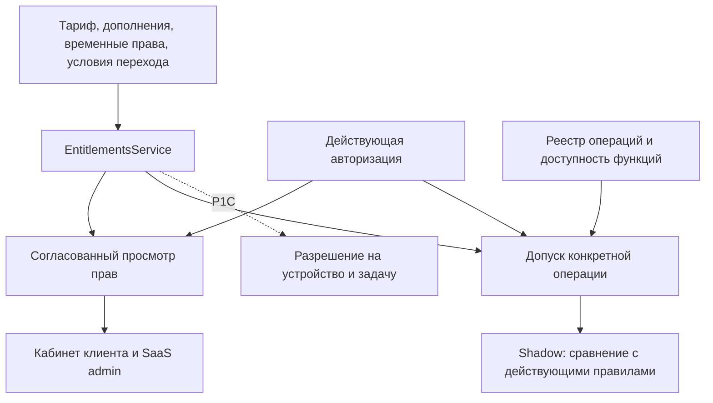

# P1A: единый расчёт прав и подготовка применения ограничений

Статус: **согласовано пользователем 2026-09-11; реализация и финальное ревью P1A завершены**.
Результаты проверок и оставшиеся ограничения записаны в
[операционном руководстве](../../operations/entitlements-p1a.md#acceptance-evidence).
Полный workspace-прогон не зелёный: сохраняется таймаут неизменённого теста клиентской
админки. Production rollout не выполнен, ограничения для клиентов не включены.
База: `39d36fd88107313aadd99f29092b5a24bf8f0626`.
Требования: [MKR-FR-COMMERCIAL-002 v1.2](2026-09-10-catalog-entitlements-functional-requirements.md).
Предшественник: [Commercial P0](2026-09-10-commercial-p0-design.md), merged PR #503.
Рабочая ветка: `codex/entitlements-p1`.

## Результат и этапы

P1A делает права объяснимыми и проверяемыми на сервере. В каталоге появляются четыре новых
модуля, в представлениях подписки — источники прав и условия перехода, в сервисах — единая
классификация действий. Новые ограничения сначала вычисляются в shadow-режиме: система
показывает, что изменится, сохраняя действующее поведение клиента.

P1 разделён на последовательные части. Завершение P1A не означает завершение всего P1.

| Этап                 | Проверяемый результат                                                                                                                                                   |
| -------------------- | ----------------------------------------------------------------------------------------------------------------------------------------------------------------------- |
| **P1A, этот проект** | Реестр модулей/операций, единый resolver, источники прав, совместимые контракты, просмотр прав, подготовка совместимости и shadow-проверки ЧЗ/НК                        |
| **P1B**              | Общая лицензия устройств, перенос/повторное подключение, выбор сохраняемых устройств при понижении тарифа, согласованные изменения и проверки остальных онлайн-операций |
| **P1C**              | Ограниченные разрешения на офлайн-работу и завершение задач, Station/ТСД/киоск, подпись и ключи, часы и перезапуск, сохранение и разбор поздних данных                  |
| **P1D**              | Отчёт по реальным клиентам, согласованные условия перехода, совместимые версии приложений, пилот и включение новых ограничений по клиентам                              |

P2 с периодическими услугами остаётся отдельным этапом. Production rollout P0 также не
входит в эту разработку. Полный минимальный коммерческий релиз требует P0 и всех частей P1.

## Исходная база и запланированные изменения

- `EntitlementsService` выбирает тариф и дополнения по времени, считает квоты и использует
  транзакционные блокировки. Сейчас в нём только `labelEditor`, `publicApi`, `pallets`.
- Использование `stations` уже учитывает все неотозванные записи устройств, включая ТСД.
  Отдельный счётчик ТСД не нужен.
- SaaS `SubscriptionPanel` частично считает права в браузере. Его текущие показатели должны
  приходить из серверного ответа, как и показатели кабинета клиента.
- Guard различает запись, feature, чтение и recovery, но сам по себе не описывает внешний
  эффект GET-запроса или действия worker.
- Восстановление Station уже сохраняет/изолирует данные и проверяет исходную смену.
  Оно ещё не реализует ограниченное разрешение P1 на завершение задачи.
- Station строго проверяет форму ответа pairing. ТСД объявляет `subscription-state-v1`,
  но его текущие PairResponse/IdentityResponse не сохраняют данные подписки. Объявленный
  capability сам по себе не доказывает готовность клиента к P1.

## Выбранное направление

Рекомендация по [трём вариантам интерфейса](../../design-briefs/2026-09-11-entitlements-p1-interface-options.md):
снимок для объяснения прав, типизированный допуск для действий, отдельное разрешение на
работу устройства в P1C.

Фасад операций использует существующие авторизацию и resolver. Он не становится вторым
источником тарифных правил и не внедряется обратно в `EntitlementsService`: текущий
`AuthorizationService` уже зависит от resolver. Бизнес-сервисы сохраняют свои транзакции,
очереди, идемпотентность, leases, снимки и записи аудита.

## Коммерческие модули и версии операций

Добавляются `chzIntegration`, `inventory`, `commerceMl`, `handheld`; прежние три ключа сохраняются.
Поле `maxStations` и общая квота `stations` остаются. В интерфейсе это «Рабочие устройства:
станции и ТСД». Киоски считаются отдельно.

`chzIntegration` включает ЧЗ и Национальный каталог. Отдельного коммерческого переключателя
НК нет. В примере Start это платное дополнение. Пример не публикует производственный тариф.

Каждое защищаемое действие имеет постоянный ID и версию в закрытом реестре. В нём записаны
требуемые модули, существующая operational capability, release eligibility и класс действия:
новая работа, продолжение отправленной операции, чтение сохранённого результата или приём
доказательств. Произвольный клиентский флаг `recovery` не выбирает этот класс.

- Свежий поиск, предложение импорта и применение/обновление НК требуют `chzIntegration`.
- Новая инвентаризация из файла требует `inventory`; свежий экспорт из ЧЗ — оба модуля.
- CommerceML имеет собственный purpose и модуль, независимо от `publicApi`.
- Только настоящий клиентский API-ключ добавляет требование `publicApi` к модулю операции.
  Внутренние клиенты, Signer и аутентификация не приобретают это требование автоматически.
- Новая будущая отправка регуляторного документа не становится доступной от одного
  `chzIntegration: true` без явного решения о версии операции и её выпуске.

Предел числа эффектов дополнения выводится из реестра: четыре квоты и семь features, сейчас
одиннадцать ключей. Дубликаты, неизвестные ключи и неверная форма эффекта отклоняются.

## Источники и согласованность расчёта

Источники: опубликованный тариф, оплаченные/назначенные дополнения, временное положительное
право и явно согласованное назначение совместимости. Источник содержит tenant, версию,
интервал, разрешённый набор версий операций и ссылку на аудируемое решение.

Временное право имеет обязательный конечный срок, причину и ссылку на коммерческое/пилотное
решение. Оно добавляет feature или положительную квоту и не продлевает базовую подписку.
Постоянные бесплатные условия оформляются управляемым планом/назначением. Отрицательных
коммерческих overrides нет; блокировка безопасности остаётся отдельной.

Новые tenant-scoped записи временных прав и совместимости содержат ID, tenant, границы
действия, версию эффектов/операций, автора, причину, ссылку на решение, request ID и сведения
об отзыве. Версия условий сохраняется неизменяемой; изменение создаёт новую версию/событие,
а не переписывает прежний источник. Начальное наблюдение P1 отмечается как наблюдение на
конкретный момент и не выдаётся за доказательство более ранних условий.

Количество дополнения умножает ресурс, а не срок. Feature объединяется по активным
источникам. Истечение одного источника не выключает право, которое даёт другой. Ноль,
конечное значение и unlimited сохраняют значения P0.

Чтение прав и источников выполняется в одном согласованном снимке БД. Текущее использование
снабжается `countedAt`, расчёт прав — `asOf`, наблюдение доступности соединения — своим временем.
Для решения о новой операции используются свежие серверные время и факты, а не присланные
клиентом `asOf`, список features или ранее отображённый снимок.

Изменение подписки, дополнения, назначения/отзыва права или совместимости повышает revision
в той же транзакции. Доступность версии операции и назначение устройства имеют собственные
компоненты revision. Истечение определяется временем, даже без выполнения фоновой задачи.
До ближайшей временной границы решение нельзя считать актуальным только по совпадению revision.
В P1A нет долговременного онлайн-кеша разрешений.
Preview также связывается с проверенными использованием/назначениями и временем действия:
одно совпадение revision тарифных условий не скрывает изменение занятой ёмкости.

Нельзя показывать сегодняшнее количество устройств как историческое. До сохранённых
снимков P1 точная история прав/использования может отсутствовать: возвращается явная
недоступность, а не выдуманная реконструкция. Снимок допуска сохраняет факты именно этого
действия. Исторический просмотр не разрешает новое действие.

## Совместимость без переписывания истории

Новые столбцы и записи добавляются новой миграцией после фактического head журнала на момент
реализации. Номер заранее не фиксируется. Применённые миграции и исторические документы не меняются.
У существующих версий неопределённые новые feature-поля сохраняются как legacy-состояние;
новый P1-черновик требует явных значений. Неопределённость не выдаётся за четыре запрета.

Для старого клиента требуется рассмотренное назначение совместимости. Оно хранит конкретный
разрешённый набор версий операций. Например, прежнее право только на НК может соответствовать
объединённому модулю, сохраняя ограничение на операции НК. Оно не открывает дополнительные
операции ЧЗ. Использование функции в недавних логах и готовность токена не доказывают право.
Автоматического массового назначения по этим признакам нет.

В P1A реализуются tenant-scoped подготовка, preview и подтверждение таких назначений и
временных прав с действующей platform capability, причиной, correlation/request ID и точным
аудитом. Подтверждение привязано к revision и интервалу; повтор одной команды не создаёт
второе назначение. Назначение совместимости описывает только новые модульные условия,
не продлевает истёкшую базу и не меняет ранее оплаченные квоты. Применение к реальным клиентам
и включение новых ограничений остаются rollout-действиями P1D.

Подтверждённые источники P1 на этом этапе имеют явный статус «подготовлено к переходу»:
их эффекты участвуют в расчёте P1 и preview, но не меняют действующий допуск по старой
политике. В ответе и UI разделяются действующие и подготовленные источники. Активация
источников вместе с новой политикой требует отдельного согласованного перехода; нельзя
назвать подготовленное временное право уже действующим. Прежние назначения P0 продолжают
работать по существующему контракту.

Изменение/отзыв прав требует `tenants.write` и `billing.write`, как текущее назначение
подписки. Изменение каталога остаётся под `catalog.write`. Tenant administrator не может
выдать право самому себе. Снижающий права отзыв проходит тот же preview/confirmation;
внутренние финансовые сведения фильтруются действующей моделью platform capabilities.

Коммерческие маршруты получают `X-Markiro-Commercial-Version: 3` с отдельными strict-схемами.
Варианты без заголовка и с `2` сохраняют прежнюю форму. Boolean-helper `isCommercialV2`
заменяется явным выбором версии. Версия 3 включает P0 и новые условия P1.

Публикация новых условий по V3 требует всех четырёх явных значений и ссылки на одобренную
версию lifecycle policy. Неполная политика допускает подготовку черновика и shadow-анализ,
но не публикацию/активацию новых ограничивающих условий. Тестовые policy fixtures не являются
утверждёнными условиями производства. Прежняя публикация P0 сохраняет свой контракт и не
может молча опубликовать новые условия, которых клиент не умеет выразить.

Нельзя фильтровать купленные эффекты ради старого парсера. Непредставимые новые поля/эффекты
или изменение, которое старый writer не может выразить безопасно, дают `client_update_required`.
Прежние snapshot/байты документов сохраняются; доступные чтение, скачивание и восстановление
проверяются отдельно. Матрица совместимости включает вложенные selectors, offers, invoices
и ответы tenant/addon.

Новая ограниченная проекция `GET /access/entitlements` имеет собственную схему `version: 1`;
старый `/access/me` не расширяется. Platform получает защищённую tenant-scoped проекцию через
свою границу авторизации. Эти ответы не содержат секретов и не являются разрешением на
офлайн-работу. Протоколы Station/ТСД/киоска не меняются в P1A.

## Первый набор вызывающих сервисов

P1A подключает shadow-адаптеры для нового поиска/предложения/применения НК, его worker и
свежей заявки экспорта ЧЗ. Получение сохранённого результата и продолжение известной внешней
операции классифицируются отдельно. Остальные семейства перечисляются в inventory покрытия
и явно остаются задачами P1B/P1C, а не объявляются проверенными автоматически.

`withAdmission` работает внутри транзакции владельца операции. Для квот сохраняются namespace,
числовой порядок блокировок и проверка вместе с записью ресурса. Перед подключением
адаптера проверяется порядок существующих timeline/quota/row locks; универсальная новая
блокировка поверх любого callback не вводится.

Worker заново проверяет действие непосредственно перед новым внешним эффектом. Сохраняются
исходный actor, tenant, каноническая область, revision, момент допуска и текущий fenced attempt.
HTTP-вызов выполняется вне транзакции. Проверка и фиксация допуска обозначают точку принятия
решения; мгновенная отмена уже летящего запроса не обещается.

Повтор request ID с прежним содержимым возвращает прежний результат. Изменившаяся команда
не маскируется под retry. Неоднозначная отправка без подтверждённого provider ID сохраняет
существующую процедуру разбора; она не даёт права безусловно создавать новую заявку.

Shadow сохраняет все текущие отказы безопасности, подписки и квот. Только дополнительные
отказы P1 наблюдаются без применения. Ошибка shadow-расчёта явно отмечается как `unknown/error`,
а не как разрешение; она не подменяет и не ослабляет обязательную текущую проверку.
Действующий `SUBSCRIPTION_ENFORCEMENT_MODE=all` не отключается ради shadow.

## Интерфейс администратора и клиента

SaaS показывает текущий тариф/период, квоты и использование, каждый модуль с источниками,
предстоящее изменение и готовность перехода. Локальное сложение прав в `SubscriptionPanel`
заменяется серверным результатом. Вкладки и формы используют существующие компоненты UI.

Клиентский кабинет получает только разрешённое представление своего tenant: источник
«тариф / дополнение / временно предоставлено», срок, остаток конечной квоты и безопасную
причину недоступности. Внутренние причины предоставления, platform actor и закрытые
коммерческие ссылки клиенту не передаются.

Для новых модулей различаются «лицензия включает», «подключение готово» и «операция доступна».
При shadow/неполной совместимости отдельно показаны фактическое текущее поведение и расчёт
P1; пользователь не видит ложного сообщения, что работа уже заблокирована. Денежные детали
не добавляются в операционные сообщения устройств. RU/EN и обычные/narrow экраны проверяются
при реализации; новый визуальный стиль не вводится.

## Граница офлайн-политик

P1A не меняет существующие очереди, grants/proofs, области смен и восстановление устройств.
P1C отдельно определит подписанный формат, key ID/rotation, generation binding, сохранение,
проверку часов, допустимое новое действие и завершение конкретной задачи.

Запрошено решение о максимальной длительности офлайн-допуска новой работы. Значение ещё
не согласовано и не подставляется из тарифа. Также до P1C нужны границы завершения смены,
открытой тары/инвентаризации и ссылка на действующие правила хранения. Для новых политик
дополнительный billing grace по ФТ равен нулю, пока явно не утверждено иное; прежние условия
клиента этим значением не сокращаются. Эти решения не блокируют реализацию P1A.

Приём уже записанных данных, их признание корректной продукцией и новая отправка регулятору —
разные действия. Новые ограничения не удаляют очередь или собственный каталог клиента.
Недоказанные/поздние данные сохраняются в предусмотренном пути разбора. Отозванный по
безопасности credential требует независимо разрешённого восстановления.

## Проверка и завершение P1A

1. Registry/contracts: четыре новых модуля, единый ЧЗ/НК, одиннадцать уникальных эффектов,
   legacy/2/3 fixtures и старые парсеры; квоты и сохранённые документы P0 не изменены.
2. DB/API: tenant isolation, exact audit, интервалы перекрывающихся источников, отсутствие
   продления базы временным правом, согласованный снимок, revision/time boundary, stale preview
   и идемпотентное подтверждение. Миграция сохраняет legacy-значения и исторические записи.
3. Shadow: security-first, существующие отказы/квоты неизменны, mapping_required не превращён
   в unrestricted access, новый lookup/apply/dispatch отличается от receipt/continuation.
   Инвентарь маршрутов и прямых вызовов worker обнаруживает отсутствие адаптера.
4. Клиенты: серверный расчёт источников/квот, обычный и narrow вид в RU/EN, различие лицензии,
   подключения, доступности и shadow. Отказ другого tenant не раскрывает его условия.
5. Read-only impact report показывает unmanaged, отсутствие mapping/policy, несовместимые
   представления/версии и потенциальные новые отказы. Он не применяет миграцию клиентов.

Перед завершением реализации нужны стандартные gates изменённых пакетов, consumer/DB tests,
проверки схем и миграций, браузерная проверка затронутых экранов и независимое ревью.
Сервер, клиенты и результаты проверок прошли отдельные ревью задач 1–7. Клиентские экраны и сценарии
восстановления проверены в локальном браузере с синтетическими HTTP-ответами. Первичный общий прогон содержал три сбоя UI; после диагностики полный набор SaaS
прошёл 342/342, а таймаут неизменённого теста кабинета остаётся ограничением. Результаты зафиксированы в [отчёте приёмки](../../operations/entitlements-p1a.md#acceptance-evidence).
Итоговое ревью всех изменений P1A ещё не завершено в задаче 7
[плана](../plans/2026-09-11-entitlements-p1a.md).

Исходная база до реализации была проверена отдельно: frozen install, build dependencies
API (5 задач, из них 3 из кеша), guard/admission tests 11/11 и platform-contracts 156/156.
Эти числа описывают исходное состояние и не заменяют результаты приёмки новой функциональности.

## Согласованное решение

Начать с P1A в описанном объёме: серверная основа, совместимость, источники, представления
и shadow-проверки ЧЗ/НК. Пользователь подтвердил проект ответом «ок» на прямой вопрос
об утверждении P1A и начале реализации. P1B–P1D сохраняются в общей последовательности; внедрение P0,
публикация новых производственных тарифов и включение ограничений сюда не добавляются.
