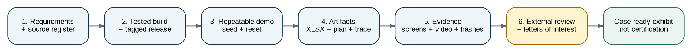

# Markiro U.S. Traceability: acceptance and test strategy

- Source: MUS-001 v0.1 (2026-09-03), sections 9.4, 10.3, 12.1–12.5, Appendix C and the case-ready checklist (Markiro_US_Case_Ready_Checklist_v0.1.csv)
- Status: baseline, not yet implemented
- Owner: Vladislav Bogatyrev

This document defines how the U.S. adaptation is accepted: performance targets, automated and browser tests, negative/overclaim tests, evidence QA, the release evidence bundle and the case-ready checklist. Requirements are defined in [requirements.md](requirements.md) and tracked in [requirements-traceability.md](requirements-traceability.md); the demo dataset that these checks run against is described in [demo-scenario.md](demo-scenario.md); slice delivery is planned in [implementation-plan.md](implementation-plan.md); explicit non-goals are in [limitations.md](limitations.md).

## 1. Performance targets

| Operation                                    | P0 target                   |
| -------------------------------------------- | --------------------------- |
| Open demo trace graph                        | <2 seconds for seed dataset |
| Search by exact TLC/reference                | <1 second for seed dataset  |
| Generate XLSX + plan + validation + manifest | <60 seconds                 |
| Seed/reset tenant                            | <2 minutes                  |
| Complete trained mock request                | <15 minutes human time      |

## 2. Test strategy

### 2.1 Unit tests

- TLC normalization, assignment basis and uniqueness scope;
- KDE validators per Receiving/Transformation/Shipping;
- location/product snapshot builders;
- lot genealogy and cycle prevention;
- no-new-TLC-on-shipping rule;
- deterministic field registry and workbook row mapping;
- retention and plan version rules.

### 2.2 Database/API tests

- fresh migration and upgrade migration;
- composite tenant FK and cross-tenant denial;
- draft → finalized → amendment → void lifecycle;
- idempotent imports and export runs;
- 2 input lots → 1 output lot → shipping chain;
- request snapshot remains stable after later amendments.

### 2.3 Browser acceptance

- U.S. onboarding and source baseline visible;
- product FTL review and classification rationale;
- three CTE forms with missing-field guidance;
- lot graph/table consistency;
- trace request wizard and validation;
- Traceability Plan preview/PDF;
- artifact package and manifest download;
- keyboard/focus/non-color status checks.

### 2.4 Negative and overclaim tests

| Case                                                         | Expected                                |
| ------------------------------------------------------------ | --------------------------------------- |
| Shipping tries to create new TLC                             | Rejected.                               |
| Covered product has unknown FTL status                       | Case-ready finalization/export blocked. |
| TLC without source                                           | Error.                                  |
| Location missing phone/ZIP/country                           | Error in compliance profile.            |
| Master data edited after finalization                        | Historical export unchanged.            |
| Duplicate import retry                                       | No duplicate event/lot.                 |
| Cross-tenant ID supplied                                     | Denied.                                 |
| UI/public copy contains the prohibited phrase "FDA-approved" | Content test/review fails.              |
| EPCIS adapter absent                                         | P0 remains functional.                  |

### 2.5 Evidence QA

1. Run all automated gates and save exact commands/results.
2. Run the browser demo from a clean seed.
3. Generate and open the XLSX in LibreOffice and Excel when available.
4. Render the Traceability Plan PDF and inspect every page.
5. Verify the ZIP manifest and SHA-256.
6. Record checks not performed: real FDA submission, real partner EDI, Windows scanner/printer unless actually exercised.
7. Seal the evidence package and tag the release.

## 3. Verification report format

Requirement EVD-008: the evidence package must distinguish automated, browser, Windows/hardware and external validation. Every slice report (see the Definition of Done in [implementation-plan.md](implementation-plan.md) and the agent protocol in [agent-master-prompt.md](agent-master-prompt.md)) must therefore contain four separate sections, in this order, and must not contain "verified" claims that are not backed by the corresponding section:

1. Automated checks: exact commands, results, skips and environment.
2. Browser checks: what was exercised in the UI from a clean seed, with screenshots where relevant.
3. Windows/hardware checks: Station, scanner and printer checks, only if actually exercised; otherwise recorded as not performed.
4. External checks: specialist review, letters of interest or partner feedback, only if obtained; otherwise recorded as not performed.

Minimum commands for the automated section (MUS-001 §10.3):

```bash
pnpm --filter @markiro/domain test
pnpm --filter @markiro/domain typecheck
pnpm --filter @markiro/domain lint
pnpm --filter @markiro/domain build

pnpm --filter @markiro/db db:generate
pnpm --filter @markiro/db build
pnpm --filter @markiro/db test

pnpm --filter @markiro/api exec vitest run "<focused-test-path>"  # replace the placeholder before running
pnpm turbo lint typecheck test build --concurrency=1 --force
pnpm format:check

# When Station Rust changes:
cargo test --manifest-path apps/station/src-tauri/Cargo.toml
```

## 4. Release evidence bundle

| Artifact          | Minimum                                           |
| ----------------- | ------------------------------------------------- |
| Release           | tag, commit SHA, changelog, build hashes          |
| Requirements      | approved spec + traceability matrix               |
| Regulatory        | dated source register + change note               |
| Data              | synthetic seed version + reset instructions       |
| Tests             | commands, results, skips, environment             |
| Screenshots       | 12–18 PNG/WebP + manifest                         |
| Video             | 5–8 min English narrated demo                     |
| Generated records | XLSX, plan PDF, validation report, request report |
| Manifest          | SHA-256 for all artifacts                         |
| Limitations       | explicit non-goals and no-certification statement |
| External          | review note and LOIs if obtained                  |

## 5. Case-ready checklist



Figure 3. Evidence ladder from requirements to the case-ready product exhibit.

Priority meaning: P0 = filing minimum, P1 = pre-filing strengthener, P2 = post-filing. Status is maintained in this table; the source checklist is Markiro_US_Case_Ready_Checklist_v0.1.csv.

| id    | category       | item                                                       | priority | evidence                            | status      |
| ----- | -------------- | ---------------------------------------------------------- | -------- | ----------------------------------- | ----------- |
| C-001 | Regulatory     | Regulatory baseline and source refresh recorded            | P0       | Source register + dated review note | Not started |
| C-002 | Scope          | US_FSMA204_PROCESSOR profile works without RU regression   | P0       | Tests + screenshot                  | Not started |
| C-003 | Demo           | Synthetic tenant can be seeded/reset                       | P0       | Command + README + CI               | Not started |
| C-004 | Master data    | Three parties/locations and product profiles exist         | P0       | Seed + screenshots                  | Not started |
| C-005 | FTL            | Fresh-cut apple product has reviewed FTL classification    | P0       | Classification record + source      | Not started |
| C-006 | Lots           | Two inbound TLCs and one output TLC with source            | P0       | DB/API + lot cards                  | Not started |
| C-007 | Receiving      | Receiving CTE finalized with all KDEs                      | P0       | Golden event + validation           | Not started |
| C-008 | Transformation | 2 input lots -> 1 output lot genealogy                     | P0       | Graph + test                        | Not started |
| C-009 | Shipping       | 100 cases shipped with required KDEs                       | P0       | Event + trace-forward               | Not started |
| C-010 | Trace          | Backward and forward trace complete                        | P0       | Screenshot + e2e test               | Not started |
| C-011 | Export         | FDA-aligned XLSX generated                                 | P0       | Workbook + validation               | Not started |
| C-012 | Plan           | Versioned processor Traceability Plan PDF generated        | P0       | PDF + version history               | Not started |
| C-013 | Request        | Mock request package generated within 15 min operator time | P0       | Timed report                        | Not started |
| C-014 | Performance    | Artifact generation under 60 sec                           | P0       | Timed automated run                 | Not started |
| C-015 | Evidence       | Release tag, commit SHA and hashes preserved               | P0       | Release + manifest                  | Not started |
| C-016 | Evidence       | 12-18 screenshots and 5-8 min video                        | P0       | Manifest + media                    | Not started |
| C-017 | Docs           | Architecture, data dictionary, limitations, demo script    | P0       | Published docs                      | Not started |
| C-018 | Quality        | CI and full repo gates green                               | P0       | CI link/report                      | Not started |
| C-019 | Quality        | No real data/PII/secrets in demo                           | P0       | Privacy checklist                   | Not started |
| C-020 | Claims         | No FDA-approved/certified/full-compliance claim            | P0       | Content review                      | Not started |
| C-021 | External       | U.S. specialist review                                     | P1       | Dated memo/email                    | Not started |
| C-022 | External       | 1-2 authentic letters of interest                          | P1       | Signed letters                      | Not started |
| C-023 | Station        | Optional offline case-to-lot demonstration                 | P1       | Windows/hardware evidence           | Not started |
| C-024 | Interop        | EPCIS adapter                                              | P2       | Post-filing                         | Not started |
