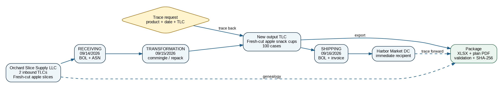

# Markiro U.S. Traceability: demo scenarios and synthetic dataset

- Source: MUS-001 v0.1 (2026-09-03), sections 4.1–4.4 and 8.1–8.5
- Status: baseline, not yet implemented
- Owner: Vladislav Bogatyrev

This document describes the product profiles, personas and the two demo scenarios of the U.S. adaptation, plus the synthetic end-to-end dataset used for the MVP demo. Requirement IDs referenced here are defined in [requirements.md](requirements.md); their implementation status is tracked in [requirements-traceability.md](requirements-traceability.md). Acceptance criteria for the demo live in [acceptance.md](acceptance.md), and the field-level meaning of every KDE is given in [data-dictionary.md](data-dictionary.md). Known non-goals are listed in [limitations.md](limitations.md).

## 1. Product profiles

| Profile                     | Purpose                           | Behavior                                                           |
| --------------------------- | --------------------------------- | ------------------------------------------------------------------ |
| RU_CHZ                      | Current Russian marking processes | No regressions; Russian fields and documents.                      |
| US_FSMA204_PROCESSOR        | Processor working with FTL foods  | FTL/TLC, Receiving/Transformation/Shipping, plan, request, export. |
| US_GENERIC_LOT_TRACEABILITY | Other food/beverage manufacturers | Lot/case/recall readiness without FTR compliance claims.           |

## 2. Personas

| Persona                   | Tasks                                                 | Key screens                           |
| ------------------------- | ----------------------------------------------------- | ------------------------------------- |
| Owner / Tenant Admin      | Configure profile, locations, roles, retention        | Onboarding, settings, readiness       |
| QA / Traceability Manager | FTL review, TLC rules, finalize events, plan, request | Products, lots, trace, plan, requests |
| Receiving Operator        | Record inbound lot and documents                      | Receiving                             |
| Production Operator       | Run shift/case flow                                   | Station, shift, output lot            |
| Shipping Operator         | Select lot/quantity/cases and recipient               | Shipping                              |
| Auditor / Read-only       | Review history and artifacts                          | Trace, audit, exports                 |

## 3. Scenario A: FSMA 204-aligned processor demo

A synthetic processor receives two lots of fresh-cut apple slices, commingles/repackages them into fresh-cut apple snack cups, assigns a new TLC, forms 100 cases, ships them to the buyer and responds to a mock request. Fresh-cut fruits are on the FTL, so the scenario is suitable for demonstrating the three-CTE chain. [FDA-02]

This scenario runs under the US_FSMA204_PROCESSOR profile and is the MVP demo. The regulatory reasoning behind it is documented in [regulatory-basis.md](regulatory-basis.md).

## 4. Scenario B: generic beverage bridge

A separate optional demo shows a craft cider/juice lot, production date, cases/SSCC, offline Station and recall search. The screen must state that the product is not classified as FTR-covered and that the demo shows general lot traceability/production control.

This scenario runs under the US_GENERIC_LOT_TRACEABILITY profile.

> Note: every Scenario B screen must explicitly state that the product is not classified as FTR-covered. Scenario B demonstrates general lot traceability and production control only; it makes no FTR compliance claim.

## 5. Synthetic end-to-end demo

Figure 2. P0 synthetic event chain for the fresh-cut apple processor.

### 5.1 Fictional parties and locations

| Role                   | Party / location                                                                  | Contact         |
| ---------------------- | --------------------------------------------------------------------------------- | --------------- |
| Previous source        | Orchard Slice Supply LLC, 100 Example Orchard Rd, Yakima, WA 98901, USA           | +1 509-555-0101 |
| Processor / TLC source | North River Fresh Foods LLC, 500 Example River Pkwy, Portland, OR 97203, USA      | +1 503-555-0120 |
| Immediate recipient    | Harbor Market Distribution Center, 200 Example Harbor Ave, Seattle, WA 98134, USA | +1 206-555-0147 |

### 5.2 Products, lots and quantities

| Item             | Description                                                      | Lot / quantity                           |
| ---------------- | ---------------------------------------------------------------- | ---------------------------------------- |
| Inbound A        | Fresh-Cut Red Delicious Apple Slices; Orchard Slice; 10 lb bag   | TLC OSS-260914-A1; 50 bags = 500 lb      |
| Inbound B        | Fresh-Cut Red Delicious Apple Slices; Orchard Slice; 10 lb bag   | TLC OSS-260914-A2; 50 bags = 500 lb      |
| Output           | Fresh-Cut Apple Snack Cups; North River; 6 oz cups, 24 cups/case | TLC NRF-260915-APL01; 100 cases = 900 lb |
| Operational loss | Trim/process loss, demo context only                             | 100 lb; not an FDA KDE                   |

### 5.3 Reference documents

| Event                     | Documents                                 |
| ------------------------- | ----------------------------------------- |
| Receiving 09/14/2026      | ASN-2026-0914-001; BOL-0914-A             |
| Transformation 09/15/2026 | WO-2026-0915-APPLECUP; BATCH-2026-0915-01 |
| Shipping 09/16/2026       | BOL-0916-H; INV-2026-0916-047             |
| Trace request 09/17/2026  | REQ-2026-APPLE-001                        |

### 5.4 Scripted demo flow (5–8 minutes)

1. Show the U.S. processor tenant, regulatory baseline and readiness dashboard.
2. Open the product classification and the "Fruits (fresh-cut)" basis.
3. Open the two Receiving lines with TLC/source, quantities, locations and ASN/BOL.
4. Open Transformation: two input lots, new output TLC, source location, 100 cases and genealogy.
5. Open Shipping: output TLC, 100 cases, recipient, BOL/invoice.
6. Run a backward trace from the output lot and a forward trace to the recipient.
7. Create a mock Trace Request, show the 24-hour due_at and the zero/missing-field validation.
8. Generate the package: XLSX, Traceability Plan PDF, validation report, manifest.
9. Show limitations: no direct FDA submission, no certification, EPCIS deferred.

### 5.5 Acceptance numbers

| Metric                           | Expected value             |
| -------------------------------- | -------------------------- |
| Input lots                       | 2                          |
| Output lots                      | 1                          |
| Receiving events                 | 1                          |
| Transformation events            | 1                          |
| Shipping events                  | 1                          |
| Output cases                     | 100                        |
| Backward trace sources           | 2 lots / 1 source location |
| Forward trace recipients         | 1 location                 |
| Missing required KDEs            | 0                          |
| Package generation               | <60 seconds                |
| Operator mock request completion | <15 minutes after training |

## 6. Data rules for the synthetic dataset

- LOC-008: no real addresses, contacts or registration numbers in the public demo seed. The dataset uses fictional names, 555 contacts and example.com.
- DOC-005: no sensitive source documents in the public synthetic demo. The public seed uses generated PDFs/metadata without real parties or credentials.
- NFR-006: data minimization and no real PII/secrets in the public demo/evidence. An automated fixture scan and a manual checklist must pass.
- PRO-004: a reproducible synthetic demo tenant and reset. One command creates an identical dataset; a repeated run is idempotent or performs a controlled reset.
- The operational loss row (100 lb) is demo context only and is not an FDA KDE; it must not appear as a required field in any export.
