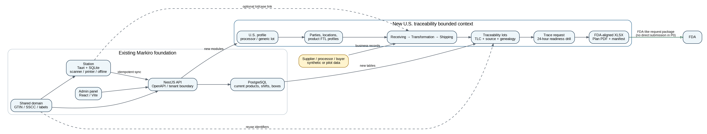

# Markiro U.S. Traceability: implementation plan

> Read the [shared MVP contract](mvp-contract.md) first. It resolves cross-slice scope and safety rules and supersedes conflicting draft recommendations below. Target design is not a completion claim; dated increment records below describe verified implementation scope.

- Source: MUS-001 v0.1 (2026-09-03), sections 11, 11.1, 11.2 and 15
- Status: US-00 and US-01 in progress as of 2026-09-05; no slice complete
- Owner: Vladislav Bogatyrev



Figure 1. Architecture scope of the U.S. adaptation as a bounded context inside the existing Markiro repository.

This plan breaks the U.S. adaptation into slices US-00..US-12 and defines an intentionally bounded MVP. Slice status is maintained here; per-requirement status is maintained in [requirements-traceability.md](requirements-traceability.md). Requirements themselves are in [requirements.md](requirements.md), acceptance gates and the MVP checklist in [acceptance.md](acceptance.md), the demo dataset in [demo-scenario.md](demo-scenario.md), the regulatory reasoning in [regulatory-basis.md](regulatory-basis.md), non-goals in [limitations.md](limitations.md), and the working protocol for coding agents in [agent-master-prompt.md](agent-master-prompt.md).

The original 115–156-hour estimate is unvalidated and does not include a proven deployment boundary. Re-estimate after US-00; eight weeks is not a commitment. Deliver the office workflow first. LOT-010/TRN-010 server-side links and synthetic cases are P0 under MUS-CR-001; all new Station behavior remains P1. US-11 owns required screenshots and video; US-12 owns optional landing and supplementary assets.

The requirement matrix owns per-requirement status and slice assignments. A boundary requirement assigned to US-00 is not evidenced until its implementing consumer passes the corresponding test.

## 1. Slices

| Slice | Result                                   | Requirements                        | Hours | Depends     | Status      |
| ----- | ---------------------------------------- | ----------------------------------- | ----- | ----------- | ----------- |
| US-00 | Deployment boundary + baseline + profile | REG-001..012, PRO-001..003, NFR-016 | 5–7   | -           | In progress |
| US-01 | Parties and locations                    | LOC-001..008                        | 8–10  | US-00       | In progress |
| US-02 | Product FTL profiles and TLC lots        | PRD-001..010, LOT-001..009          | 12–15 | US-01       | In progress |
| US-03 | Receiving CTE                            | REC-001..008, DOC-001..002          | 8–10  | US-02       | Not started |
| US-04 | Transformation and P0 server case bridge | TRN-001..014, LOT-010               | 14–18 | US-02/03    | Not started |
| US-05 | Shipping CTE                             | SHP-001..010                        | 8–11  | US-04       | Not started |
| US-06 | Trace graph, search, completeness        | TRC-001..010                        | 9–12  | US-03/04/05 | Not started |
| US-07 | FDA-aligned XLSX adapter                 | EXP-001..012                        | 12–16 | US-06       | Not started |
| US-08 | Traceability Plan                        | PLN-001..010                        | 7–10  | US-00/02    | Not started |
| US-09 | Trace request / mock recall              | RQ-001..008                         | 8–11  | US-06/07/08 | Not started |
| US-10 | Station/label lot link                   | STN-001..009                        | 8–12  | US-02/04    | Not started |
| US-11 | Demo seed, screenshots/video, release    | EVD-001..012                        | 10–14 | US-09       | Not started |
| US-12 | Optional landing and extra assets (P1)   | demo assets                         | 6–10  | US-11       | Not started |

Slice status values: Not started, In progress, Done. A slice is Done only when its Definition of Done from MUS-001 §10.2 is met and its verification report (see [acceptance.md](acceptance.md)) is filed.

### US-00 first increment — 2026-09-05

The [domain foundation plan](../superpowers/plans/2026-09-05-us-00-domain-foundation.md) implements explicit edition parsing, immutable profile allow-lists and feature policies, and edition-specific interface locale selection in `@markiro/domain`. Its 47 focused tests and the full 532-test domain suite pass, along with both domain typechecks and the build. The [design baseline](../design-briefs/us/08-design-baseline.md) contains 128 screens in 18 sections.

The separate US development API now consumes edition parsing and locale policy. Its validated entry rejects unsafe local configuration and production mode; the RU entry rejects explicit US configuration before auth/database setup. Metadata and liveness work, while business readiness deliberately remains unavailable. This is a metadata-only boundary, not an implemented office application. Persistent profiles, provisioning, authorization, frontend/build attestation and infrastructure verification remain open. No deployment or publication is included.

The [development isolation boundary](development-isolation.md) is now prepared locally on `codex/us-mvp`: inherited operational workflows are locked, check-only US CI is defined, and a separate synthetic dependency stack is configured. The [runtime entry plan](../superpowers/plans/2026-09-05-us-00-runtime-entry.md) records this runnable API increment and its limits. It does not complete end-to-end edition isolation or establish hosted infrastructure. US-00 remains In progress.

### US-00 profile persistence increment — 2026-09-05

The [profile persistence plan](../superpowers/plans/2026-09-05-us-00-profile-persistence.md) adds the profile table, a strict initial-provisioning contract and an internal transactional US settings store. It requires a current tenant-settings membership, an explicit US profile and an IANA timezone. The store serializes concurrent initial requests and writes profile, timezone and audit together. Identical retries do not create another audit event; different initial settings conflict. Profile switching and edits are not exposed by this provisioning operation.

Migration and store tests use randomly named disposable databases on the separate local US PostgreSQL. Existing RU defaults remain unchanged. At that increment the US HTTP composition had no profile endpoint or session adapter; the later increment below adds that integration. Requirement rows are not marked complete by storage-only proof.

### US-00 session and HTTP increment — 2026-09-05

The [session foundation](../superpowers/plans/2026-09-05-us-00-session-foundation.md) and [HTTP integration record](../superpowers/plans/2026-09-05-us-00-http-integration.md) add independent US cookies, mandatory per-session MFA, guarded organization selection and initial profile provisioning over the local US API. Real HTTP tests verify fresh membership/capability enforcement, exact profile audit, retry behavior, request boundaries, unavailable schema and safe database cancellation/shutdown.

The server never migrates or provisions users at startup. Overall business readiness stays unavailable; browser integration, recovery and remaining US-00 acceptance are still open. Explicit local synthetic-user provisioning is covered by the increment below. Release locks remain active. This is not completion of the slice or proof of hosted data-location requirements.

## 2. Dependency sequence

### Local owner increment — 2026-09-05

The [local synthetic-owner command](local-owner-provisioning.md) supplies explicit local identity bootstrap with atomic audit, collision/retry safeguards and no MFA bypass. It does not migrate or seed on startup, provision a profile or enable public signup. Tests use disposable US databases. The next US-00 integration surface is the edition-specific browser login/MFA/profile workflow; recovery, auth-event audit and hosted safeguards remain open.

### Browser client increment — 2026-09-05

The [US browser client foundation](browser-client-foundation.md) adds the isolated typed transport for login/MFA, organization selection and initial profile setup, with a shared strict response contract and real HTTP integration coverage. It is not imported by the RU entry. The subsequent browser increment below supplies the separate entry/build, proxy wiring and EN/ES screens; the current RU admin must not be pointed at the US API.

### Browser entry increment — 2026-09-05

The [local US browser flow](browser-entry.md) now supports password login, authenticator enrollment/challenge, backup-code login, organization selection and initial profile provisioning/readback. An independent Vite root outputs `dist-us`, imports no RU screens or translations, refuses non-US configuration, and attests the server before login. Real Chromium checks use the actual Vite proxy and disposable PostgreSQL, including cookie-safe logout during a held MFA request. English and Spanish, desktop/mobile and light/dark states were inspected. This is local access/profile functionality, not completion of US-00 or the operational MVP.

MUS-CR-001 confirms fixed-template Receiving CSV import/output (US-03), two response outcomes (US-07/09), and P0 server case links (US-04/06/11). Implement through the prerequisites below; do not build an isolated substitute pipeline. Retention calculation is implemented in the domain helper (36 tests); storage/hold enforcement and destructive-path checks remain tracked separately. Remaining US-00 acceptance includes recovery, auth-event audit and hosted safeguards. The explicit local owner command has not been applied to the base development database. Business work next follows US-01/02 without enabling deployment or declaring those remaining gates complete.

### US access increment — 2026-09-05

The [isolated US role matrix](access-foundation.md) now resolves the five traceability roles and the existing cabinet identities without extending RU capabilities. Current MFA principals reload role state, stored profile reads accept `traceability.read`, and initial provisioning remains owner/admin-only under a transactional membership lock. This is the first consumer of the policy; event/QA/export endpoints and role administration still need their own enforcement and denial tests. PRO-006 remains in progress.

### US-01 server increment — 2026-09-05

The [master-data foundation](master-data-foundation.md) adds separate US parties/locations, description snapshots, strict contracts, additive migration0115 and US-only CRUD/list/archive routes. Both profiles allow incomplete drafts; QA/manager/owner/admin can edit, other recognized US roles can read. Transactions reload permissions, validate the US profile, enforce tenant/parent boundaries and write full audit snapshots atomically. The remaining OpenAPI 400 union defect is corrected with full-schema regression coverage. The typed browser client, exact local proxy routes and connected EN/ES lists/forms are implemented. The office increment passes 1,071 admin tests and real Chromium CRUD/archive/read-only and held-request scenarios. Scoped final re-review is complete with no remaining Critical or Important findings; Minor picker-reselection residual US01-UI-01 is explicitly deferred in the foundation record. LOC-001/002/004/006 remain partial because finalized CTE consumers and historical exports are not delivered here. No deployment or publication is included.

The subsequent US01-UI-01 correction retains freshly resolved parent states across selection and search, closing the deferred picker defect. Full admin now passes 1,073 tests; focused master-data/app/client tests pass 66, and the existing real-browser flow passes. Independent scoped review has no remaining findings. No shared product schema was changed by this correction.

### US-02 catalog contract increment — 2026-09-05

Implemented `normalizeCatalogGtin` in the domain package and strict US product create/update/read schemas in platform-contracts. The package suites pass 627 domain tests and 166 contract tests, including 28 and 35 focused catalog tests respectively, with no skips. Typecheck, lint and builds pass for both packages. These are pure-rule/contract checks, not database or browser acceptance of a catalog workflow.

The owner approved a shared product model with optional GTIN for the two US profiles and required GTIN for RU, while keeping instances and databases separate. The [first catalog increment](../superpowers/plans/2026-09-05-us-02-catalog-contract-foundation.md) establishes the domain policy and strict US create/update/read contracts. It does not change nullable storage, expose catalog routes or implement FTL reviews/lots. PRD-007 runtime acceptance remains unimplemented until US writes, persistence and consumer denial tests are delivered together. The next increment must audit GTIN-dependent consumers and retain RU validation, operational payloads and barcode behavior before enabling null persistence. No deployment or publication is included.

1. US-00: edition, provisioning, authorization, data-location inventory and deployment design.
2. US-01/02: parties, locations, product profiles and lots.
3. US-03/04/05: receiving, standalone transformation and shipping.
4. US-06: trace and completeness; US-08 plan can proceed after master data.
5. US-07/09: workbook mapping, immutable request snapshot and package.
6. US-11: reproducible seed, screenshots/video, deployed smoke checks and release evidence.
7. P1: US-10 Station/hardware integration and US-12 landing/extra assets.

Slice hour ranges below are historical planning inputs, not delivery promises. Infrastructure purchase and publication require separate approval.

## 3. Critical path

```text
Profile → locations/products → lots → receiving → transformation → shipping →
trace → export + plan → mock request → release/evidence.
```

Station integration must not block the main critical path. US-10 remains P1: the administrative end-to-end workflow, generated artifacts and repeatable demo already form the MVP.

## 4. MVP boundary

### 4.1 P0: required for the MVP

- this approved specification and the regulatory source register;
- working code for Receiving, Transformation, Shipping, TLC/source, genealogy, plan, request and XLSX;
- reproducible synthetic fresh-cut apple demo;
- tagged public release with commit SHA and hashes;
- CI/test report and limitations;
- architecture/data dictionary/requirement traceability;
- generated XLSX, plan PDF, validation report, request report, manifest;
- 12–18 screenshots and a 5–8 minute English video;
- a dedicated U.S. deployment whose persisted production surfaces are not hosted in the Russian Federation.

### 4.2 P1: product hardening that does not block the MVP

- review by a U.S. food-safety/traceability professional;
- structured feedback from industry practitioners;
- design-partner or limited pilot evaluation;
- Station offline case-to-lot demonstration;
- deeper imports, partner mappings and operational controls.

### 4.3 Future product scope

The MVP does not include all CTEs and exemptions, direct FDA integration, EPCIS, RFID, full EDI, commercial billing, self-service onboarding, multi-region operations or enterprise certification. [limitations.md](limitations.md) records the complete boundary.

### 4.4 Why this remains an MVP

The MVP implements one synthetic processor scenario with three CTEs, one trace path and one export package. It deliberately omits broad integrations, additional supply-chain roles, commercial operations and enterprise hardening. Detailed requirements preserve correctness inside that narrow workflow; they do not turn the MVP into a complete production platform.

## 5. Risks and scope control

P/I = probability / impact.

| ID   | Risk                               | P/I           | Mitigation                                                                            |
| ---- | ---------------------------------- | ------------- | ------------------------------------------------------------------------------------- |
| R-01 | Regulatory baseline changes        | Medium/High   | Source refresh per release; versioned adapters; specialist review.                    |
| R-02 | Scope creep into full U.S. ERP     | High/High     | Only CTE/lot/request/export; no accounting/inventory rebuild.                         |
| R-03 | Automatic legal classification     | Medium/High   | Manual reviewed coverage status; disclaimer; no exemptions engine.                    |
| R-04 | Overengineering item serialization | High/Medium   | Lot-level core; SSCC/case optional; no item requirement.                              |
| R-05 | Limited U.S. product feedback      | Medium/Medium | Structured reviews with food-industry practitioners after the MVP works.              |
| R-06 | Export diverges from FDA template  | Medium/High   | Versioned field registry + golden fixtures + source mapping review.                   |
| R-07 | Russian workflow regression        | Low/High      | Feature profiles, additive migrations, full repo gates.                               |
| R-08 | Synthetic demo looks artificial    | Medium/Medium | Coherent quantities/docs; external reviewer; show real Markiro foundation separately. |
| R-09 | Evidence claims exceed tests       | Medium/High   | Verification report separates automated/browser/hardware/external.                    |
| R-10 | Personal/confidential data leak    | Low/High      | U.S.-hosted data plane, synthetic demo, privacy scan, redaction and access audit.     |
| R-11 | Estimate does not cover scope      | Medium/Medium | Station/EPCIS/EDI are P1/P2; protect critical path.                                   |
| R-12 | Product presented as legal advice  | Medium/High   | Claim language matrix and clear product limitations.                                  |

## 6. Final rule

> When the P0 checklist is closed, the MVP release is frozen. New ideas enter P1 or P2 unless they fix a defect or close a regulatory gap in the defined end-to-end workflow.
